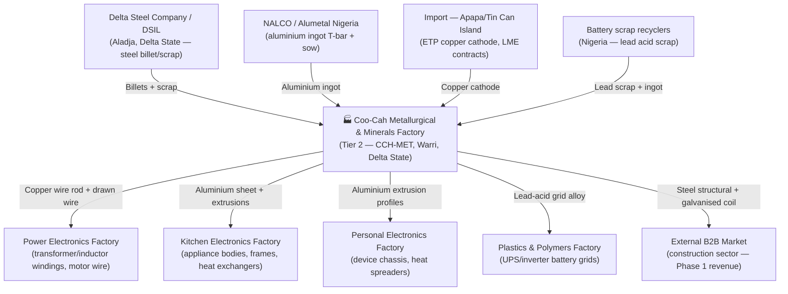

# Coo-Cah Metallurgical & Minerals Factory

> **Tier 2 Strategic Manufacturing** — This factory supplies copper wire rod, aluminium sheet,
> steel structural sections, and lead alloys to electronics, construction, and power verticals
> across the Coo-Cah ecosystem.

---

## Factory Overview

| Attribute | Detail |
| --- | --- |
| **Factory Name** | Coo-Cah Metallurgical & Minerals Factory |
| **Factory ID** | CCH-MET |
| **Repository** | `coo-cah-factory-chemicals-metallurgical` |
| **Vertical** | Chemicals |
| **Sub-Vertical** | Metallurgical — Steel, Aluminium, Copper, Lead Alloy |
| **Location** | Warri / Ovwian-Aladja Steel Corridor, Delta State, Nigeria |
| **Tier** | Tier 2 — Strategic Manufacturing |
| **Phase** | Phase 2 (Planning / Development) |
| **Status** | PLANNED |
| **Facility Area** | ~35,000 m² |
| **Peak Power Load** | ~2,500 kW |
| **Solar PV Target** | 1,000 kWp |
| **BESS Target** | 1,200 kWh LFP |
| **Employees (Phase 1)** | ~280 direct |
| **Master Repo** | <a href="https://github.com/oumar-code/Coo-Kah-Doks">Coo-Kah-Doks</a> |

---

## Products — Phase 1 SKUs

| SKU Code | Product Description | Process | Priority |
| --- | --- | --- | --- |
| CCH-MET-001 | Steel sheet coil (0.5–3 mm CRCA) | Cold rolling mill | Phase 1 Start |
| CCH-MET-002 | Steel structural section (angle, channel, beam) | Structural rolling | Phase 1 Start |
| CCH-MET-003 | Aluminium sheet + coil (1050, 3003, 5052) | Aluminium rolling | Phase 1 Mid |
| CCH-MET-004 | Aluminium extrusion profiles (6060, 6063) | Extrusion press | Phase 1 Mid |
| **CCH-MET-005** | **Copper wire rod and drawn wire (ETP grade)** | **Wire drawing** | **Phase 1 Priority** |
| CCH-MET-006 | Galvanised steel coil (30–275 gsm coating) | Hot-dip galvanising | Phase 1 Late |
| CCH-MET-007 | Stainless steel sheet (304, 316) | Cold rolling + annealing | Phase 1 Late |
| CCH-MET-008 | Lead-acid battery grid alloy (Pb-Sb, Pb-Ca) | Alloy casting | Phase 1 Mid |

> **Priority focus:** CCH-MET-005 (copper wire rod) — highest intra-group demand from
> coo-cah-factory-electronics-power (transformer wire) and highest B2B market value.

---

## Strategic Role in the Coo-Cah Ecosystem

This factory sits at the **industrial feedstock layer** of the Coo-Cah manufacturing stack.
Without domestically produced copper, aluminium, and steel, every downstream electronics,
appliance, and power factory faces import dependency and FX risk.

