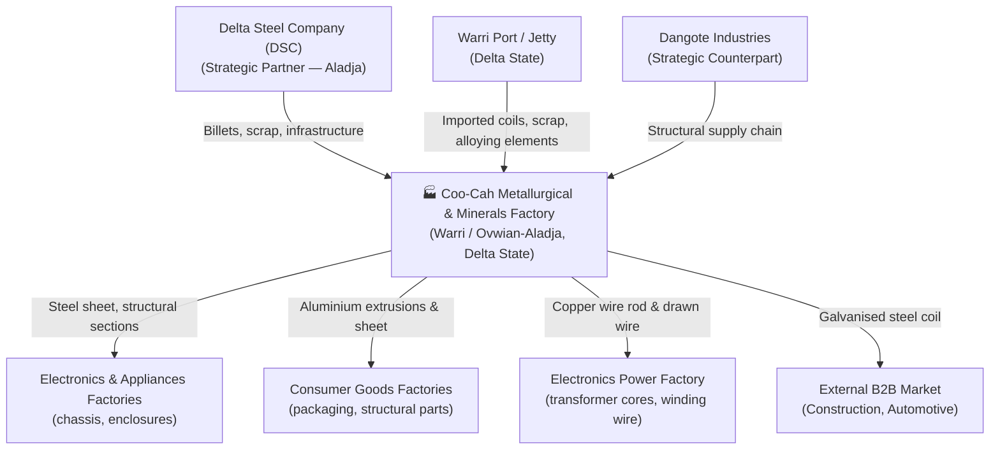

# Coo-Cah Metallurgical & Minerals Factory

> **Repository:** `coo-cah-factory-chemicals-metallurgical`
> **Master Repo:** [oumar-code/Coo-Kah-Doks](https://github.com/oumar-code/Coo-Kah-Doks) — Single source of truth for strategy, architecture, blueprints, and group-wide standards.
> See [MASTER_REPO_REF.md](./MASTER_REPO_REF.md) for full traceability.

---

## Factory Overview

| Attribute | Value |
|---|---|
| **Factory Name** | Coo-Cah Metallurgical & Minerals Factory |
| **Repository** | `coo-cah-factory-chemicals-metallurgical` |
| **Location** | Warri / Ovwian-Aladja Steel Corridor, Delta State, Nigeria |
| **Vertical** | Chemicals — Metallurgical Sub-vertical |
| **Tier** | Tier 2 — Strategic Infrastructure |
| **Phase** | Phase 2 |
| **Status** | PLANNED |
| **Facility Area** | ~35,000 m² |
| **Employees** | ~280 direct (Phase 1 target) |
| **Peak Power Load** | ~2,500 kW |
| **Solar PV** | 1,000 kWp |
| **BESS** | 1,200 kWh LFP |
| **Quality Standards** | ISO 9001:2015 · ISO 45001:2018 · SON NIS |

---

## Strategic Role in the Coo-Cah Ecosystem

This factory produces structural metals, alloys, and precision metal components that feed other
Coo-Cah factory verticals — reducing reliance on imported steel, aluminium, and copper products.

Located in the Warri / Ovwian-Aladja Steel Corridor, the factory leverages proximity to
Delta Steel Company's existing infrastructure, Warri port logistics, and the Ovwian-Aladja
Free Zone for export opportunities.

```mermaid
graph TD
    MF["🏭 Coo-Cah Metallurgical & Minerals Factory<br/>(Warri / Ovwian-Aladja, Delta State)"]

    MF -->|Steel sheet, structural sections| EL["Electronics & Appliances Factories<br/>(chassis, enclosures)"]
    MF -->|Aluminium extrusions & sheet| CG["Consumer Goods Factories<br/>(packaging, structural parts)"]
    MF -->|Copper wire rod & drawn wire| PWR["Electronics Power Factory<br/>(transformer cores, winding wire)"]
    MF -->|Galvanised steel coil| EX["External B2B Market<br/>(Construction, Automotive)"]

    DSCO["Delta Steel Company (DSC)<br/>(Strategic Partner — Aladja)"] -->|Billets, scrap, infrastructure| MF
    WARRI["Warri Port / Jetty<br/>(Delta State)"] -->|Imported coils, scrap, alloying elements| MF
    DANGOTE["Dangote Industries<br/>(Strategic Counterpart)"] -->|Structural supply chain| MF
```

---

## Products — Phase 1

| SKU Code | Product | Process | Phase |
|---|---|---|---|
| CCH-MET-001 | Steel sheet coil (0.5–3 mm CRCA) | Cold rolling | Phase 1 |
| CCH-MET-002 | Steel structural section (angle, channel, beam) | Section rolling | Phase 1 |
| CCH-MET-003 | Aluminium sheet + coil (1050, 3003, 5052) | Aluminium rolling | Phase 1 |
| CCH-MET-004 | Aluminium extrusion profiles (6060, 6063) | Extrusion | Phase 1 |
| CCH-MET-005 | Copper wire rod and drawn wire (ETP grade) | Continuous casting + drawing | Phase 1 |
| CCH-MET-006 | Galvanised steel coil (30–275 gsm coating) | Hot-dip galvanising | Phase 1 |
| CCH-MET-007 | Stainless steel sheet (304, 316) | Cold rolling + annealing | Phase 1 |
| CCH-MET-008 | Lead-acid battery grid alloy (Pb-Sb, Pb-Ca) | Alloying + casting | Phase 1 |

> **Starting focus:** CCH-MET-001 (CRCA steel coil), CCH-MET-004 (aluminium extrusions), and
> CCH-MET-005 (copper wire rod) — highest internal demand from the electronics vertical.

---

## Energy Profile Summary

| Parameter | Value |
|---|---|
| Facility Area | ~35,000 m² |
| Estimated Peak Load | ~2,500 kW |
| Solar PV | 1,000 kWp |
| BESS | 1,200 kWh LFP |
| Target Solar Self-Sufficiency | ≥ 70% |
| Grid Supply (Warri DISCO) | Variable — factory designed for partial independence |
| Backup Generator | Multiple diesel gensets per process zone |

---

## Strategic Suppliers

### 🔶 Delta Steel Company (DSC) — Primary Steel Partner (Tier A Critical)
- **Location:** Aladja, Uvwie LGA, Delta State (adjacent to factory site)
- **Significance:** Nigeria's most established integrated steel plant; existing billets, scrap, and
  infrastructure ready for partnership
- **Role:** Primary feedstock (billets, scrap) for all steel product lines (CCH-MET-001, CCH-MET-002, CCH-MET-006)
- **Strategy:** Negotiate long-term feedstock agreement; leverage DSC's underutilised capacity and
  infrastructure synergies

### 🔶 Warri Port / Ovwian-Aladja Jetty — Import Logistics Hub (Tier A)
- **Location:** Warri, Delta State
- **Significance:** Direct maritime access for imported scrap, aluminium billets, copper cathodes,
  and alloy elements — avoiding Lagos congestion
- **Role:** All sea-freight raw material imports pass through Warri Port
- **Strategy:** Establish dedicated berth arrangement with Warri Port Authority; coordinate with
  Delta State Government for infrastructure improvements

---

## Phase 1 Implementation Checklist

### Site & Legal
- [ ] Execute lease / acquisition for 35,000 m² at Ovwian-Aladja Steel Corridor
- [ ] Incorporate factory operating entity (RC number, FIRS TIN)
- [ ] Engage Delta State Government for Pioneer Status incentives
- [ ] Open corporate bank accounts; set up treasury for CapEx drawdown

### Regulatory & Permitting
- [ ] NESREA Environmental Impact Assessment (EIA) submission and approval
- [ ] DPR/NUPRC permit for hydrocarbon and industrial fuel handling
- [ ] Ministry of Mines and Steel Development registration
- [ ] SON product certification for structural steel sections
- [ ] NCS Form M registration for raw material imports (copper cathodes, aluminium billets)
- [ ] FIRS Pioneer Status application (tax holiday — Phase 2 target)

### Infrastructure & Utilities
- [ ] 33 kV grid connection agreement with DISCO (Warri area)
- [ ] Install 1,000 kWp solar PV system + 1,200 kWh LFP BESS
- [ ] Diesel generator backup (multiple units per zone)
- [ ] Compressed air ring main for rolling line pneumatics
- [ ] Industrial water supply and cooling tower system
- [ ] Effluent treatment and pickling waste neutralisation plant

### Equipment Procurement
- [ ] Cold rolling mill (CRCA line) — CCH-MET-001
- [ ] Section rolling mill (angle/channel/beam) — CCH-MET-002
- [ ] Aluminium rolling line — CCH-MET-003
- [ ] Aluminium extrusion press (6/8-inch billet) — CCH-MET-004
- [ ] Copper continuous casting + wire drawing line — CCH-MET-005
- [ ] Hot-dip galvanising bath + strip preparation line — CCH-MET-006
- [ ] DCS/SCADA system (Siemens PCS 7 or Honeywell Experion PKS)
- [ ] MES software and server infrastructure
- [ ] IoT sensor deployment (target ≥ 85% asset coverage)

### Certifications (Phase 1 targets)
- [ ] ISO 9001:2015 Quality Management
- [ ] ISO 14001:2015 Environmental Management
- [ ] ISO 45001:2018 Health & Safety

### Production Commissioning
- [ ] Trial run CCH-MET-001 (CRCA steel coil) — first production batch
- [ ] Trial run CCH-MET-004 (aluminium extrusions) — first production run
- [ ] Trial run CCH-MET-005 (copper wire rod) — first coil
- [ ] First internal delivery to `coo-cah-factory-electronics-power` (copper wire, aluminium)
- [ ] Full Phase 1 line ramp to target OEE ≥ 75%

---

## Documentation Index

| Document | Description |
|---|---|
| [MASTER_REPO_REF.md](./MASTER_REPO_REF.md) | Link to Coo-Kah-Doks master repo; standards traceability |
| [docs/machinery.md](./docs/machinery.md) | Full equipment register: rolling mills, extrusion, drawing, galvanising, DCS |
| [docs/energy-profile.md](./docs/energy-profile.md) | Power demand analysis, solar/BESS sizing |
| [docs/floor-plan.md](./docs/floor-plan.md) | 35,000 m² site layout: process zones, utilities, storage |
| [docs/automation-roadmap.md](./docs/automation-roadmap.md) | DCS/MES → AI optimisation → autonomous control roadmap |
| [docs/supply-chain.md](./docs/supply-chain.md) | DSC partnership, Warri Port imports, intra-group flows |
| [docs/regulatory.md](./docs/regulatory.md) | NESREA, Ministry of Mines, SON, DPR compliance |
| [docs/capex-opex.md](./docs/capex-opex.md) | Financial model: phased CapEx, OpEx, unit economics |
| [docs/digital-twin.md](./docs/digital-twin.md) | Process asset registry, rolling mill DT, energy monitoring |
| [docs/mes-integration.md](./docs/mes-integration.md) | Heat/coil tracking, DCS integration, API endpoints |

---

## Repository Governance

This repository is part of the **Coo-Cah Technologies Holdings** manufacturing ecosystem.

- **Master orchestrating repo:** [oumar-code/Coo-Kah-Doks](https://github.com/oumar-code/Coo-Kah-Doks)
- **Factory template version:** v1.0
- **Standards reference:** All group-wide standards (ISO, automation phases, supply chain doctrine,
  energy strategy, AI platform, MES integration) are defined in `docs/` of the master repo.
- **Traceability:** Factory blueprints originate from `factories/chemicals/metallurgical/` in the
  master repo.

> All documents in this repository must be consistent with and traceable back to Coo-Kah-Doks.

---

*Coo-Cah Technologies Holdings · Manufacturing Ecosystem · Metallurgical & Minerals Factory*
