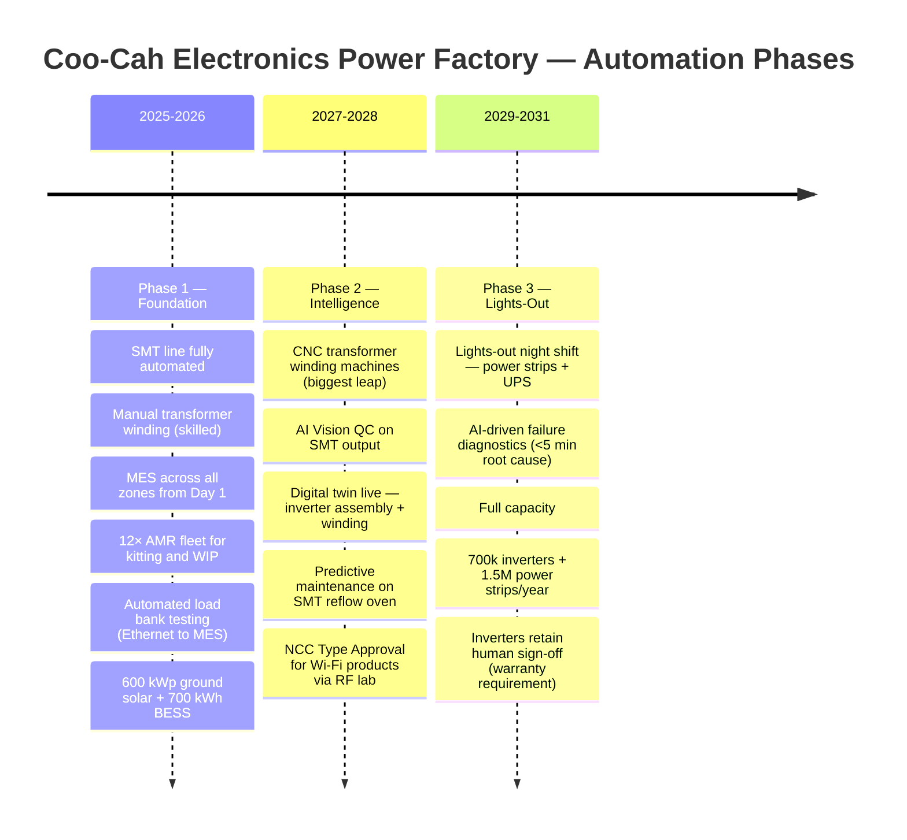
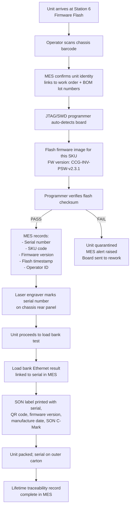

# Automation Roadmap

<<<<<<< copilot/create-factory-repository
> **Factory:** Coo-Cah Garage & Power Electronics Factory — Sagamu, Ogun State  
> **Model:** Discrete Electronics Assembly Automation (not chemical/process)  
=======
> **Factory:** Coo-Cah Garage & Power Electronics Factory — Sagamu, Ogun State
> **Model:** Discrete Electronics Assembly Automation (not chemical/process)
>>>>>>> main
> **Master Repo Ref:** [oumar-code/Coo-Kah-Doks](https://github.com/oumar-code/Coo-Kah-Doks) → `docs/standards/automation-phases.md`

---

## Automation Philosophy

> *"Automate what is repetitive and low-complexity first. Apply intelligence where the complexity — and quality risk — is highest. Never automate the quality gateway away."*

This factory's automation strategy is shaped by one critical insight: **transformer and inductor winding is the most labour-intensive and precision-demanding operation in the building — not PCB assembly.** The SMT line is fully automated from Day 1. The winding cell is manually skilled in Phase 1. CNC winding automation in Phase 2 is the single most impactful productivity improvement in this factory's lifecycle.

A second guiding principle: **100% load bank testing of every unit is non-negotiable.** This is the quality foundation and the basis of the Coo-Cah 2-year warranty. No automation will reduce or bypass this testing requirement through Phase 3.

---

## Phase Overview

---

## Phase 1 (2025–2026): Foundation

### 1.1 SMT PCB Assembly Line — Fully Automated

The SMT line is automated end-to-end from Day 1. This is standard practice in the industry; manual SMT is not viable for the volume and quality targets.

| Stage | Automation Level | Equipment |
<<<<<<< copilot/create-factory-repository
|---|---|---|
=======
| --- | --- | --- |
>>>>>>> main
| Solder paste printing | Fully automated | DEK/Ekra printer with vision alignment |
| Solder paste inspection | 100% inline 3D inspection | Koh Young / Viscom SPI |
| Component placement | Fully automated (two P&P machines) | Fuji NXT III + Yamaha YSM40R |
| Reflow soldering | Fully automated (recipe-driven) | Heller/BTU 10-zone oven |
| Automated optical inspection | 100% post-reflow 3D AOI | Koh Young Zenith / Mirtec MV-9 |
| In-circuit test | Automated bed-of-nails or flying probe | Keysight i3070 |
| Depanelling | CNC router | YSCUT-T1 |
| Component management | Smart tower storage with MES integration | Mycronic MX Tower |

**MES integration (Phase 1):** Every panel gets a barcode at paste print. MES tracks the panel through every SMT stage. AOI and ICT results are automatically written to MES against the panel barcode. Failed boards are quarantined automatically. Traceability: which reel, which machine, which operator confirmed the batch.

### 1.2 Transformer & Inductor Winding — MANUAL (Phase 1)

> **Why manual in Phase 1?** CNC toroidal and bobbin winding machines suitable for Coo-Cah's product mix cost ₦15M–₦25M each. In Phase 1, volume is insufficient to justify the capital. Skilled manual winders can achieve output targets with the planned headcount. CNC deployment in Phase 2 unlocks Phase 2 capacity.

| Operation | Phase 1 Approach | Productivity (per shift) |
<<<<<<< copilot/create-factory-repository
|---|---|---|
=======
| --- | --- | --- |
>>>>>>> main
| Toroidal core winding (inverter main transformer) | Manual-assist winding jig; 2 winders per machine | 25–40 units/shift (2kVA transformer) |
| EI core winding (smaller inverters, UPS) | Manual bobbin winder with layer counter | 60–80 units/shift |
| Inductor winding (output filter inductors) | Manual air-core winder with mandrel | 100–150 units/shift |
| Transformer testing | Manual connection to Chroma/HV transformer tester | 100% tested; 2 test stations |
| Varnish impregnation | Manual load/unload of vacuum varnish tank | Batch process; 4h cycle per batch |

**Quality controls (Phase 1 manual winding):**
<<<<<<< copilot/create-factory-repository
=======

>>>>>>> main
- Wire gauge go/no-go check per batch
- Turns count verified against traveller card at each layer
- Inter-winding insulation resistance tested before varnish
- Post-cure transformer test (turns ratio, Hipot, DC resistance) recorded in MES by serial number

**Training:** All winding operators complete a 4-week structured training programme on wire tension, layer insulation, turns counting, and safe handling of varnish compounds. Certification required before independent operation.

### 1.3 Inverter Assembly — Manual with Conveyor Assist

8-station balanced flow line on a low-voltage conveyor. Each station has a MES terminal (tablet/fixed display) showing the traveller card and torque specifications for that station.

**Phase 1 assembly automation elements:**
<<<<<<< copilot/create-factory-repository
=======

>>>>>>> main
- Conveyor paces throughput (variable speed controller)
- Torque screwdrivers connected to MES — torque value and pass/fail recorded per fastener on critical joints
- Firmware flash station: automatic — operator connects cable; programmer auto-detects unit; flashes firmware; records firmware version + serial number in MES
- Laser engraving of serial number on chassis: automatic (operator loads unit; laser engraves; ejects)

### 1.4 MES Deployment — All Zones from Day 1

The MES is the central nervous system of the factory from its first day of operation. This is a group standard and non-negotiable (see master repo `docs/standards/mes-integration-standards.md`).

**Phase 1 MES scope:**
<<<<<<< copilot/create-factory-repository
| Zone | MES Function |
|---|---|
=======

| Zone | MES Function |
| --- | --- |
>>>>>>> main
| Receiving | GRN (goods received note) against PO; quarantine/accept flag |
| Raw Material Store | Inventory management; FIFO pick lists; lot traceability; expiry alerts (solder paste) |
| SMT Line | Panel barcode; AOI/ICT result capture; reel tracking; operator login |
| Winding Cell | Work order dispatch; traveller card; transformer test data; varnish batch records |
| Assembly Line | Traveller card at each station; torque records; firmware version link |
| Test Zone | Load bank test data (Ethernet direct from Chroma equipment); PASS/FAIL against serial |
| Packaging | Auto-generate SON-compliant label at print-and-apply; serial link to shipping document |
| Finished Goods | Inventory by serial number; despatch document generation; customer order link |
| Energy | Solar PV yield; BESS SoC; grid import; generator hours; zone energy metering |

### 1.5 AMR Fleet

12 × Geek+ P40 (or equivalent) autonomous mobile robots deployed from factory opening day.

**Phase 1 AMR tasks:**
<<<<<<< copilot/create-factory-repository
=======

>>>>>>> main
- Kitting: deliver component kits from raw material store to SMT and assembly stations
- WIP transport: move finished PCBs from SMT to winding/assembly; move assemblies to test zone
- Empty carton return: collect empty component boxes from assembly lines; return to waste/recycling
- Finished goods: move packaged units from packaging to finished goods warehouse

**MES-AMR integration:** When MES generates a production order, the AMR FMS receives a task to pull the BOM kit from the warehouse. Operators do not physically walk to collect components. The AMR delivers a pre-picked kit to the station.

### 1.6 Energy Systems — Commissioned Phase 1

600 kWp ground solar + 700 kWh LFP BESS commissioned during Phase 1 building-out. See [docs/energy-profile.md](./energy-profile.md).

---

## Phase 2 (2027–2028): Intelligence

### 2.1 CNC Transformer Winding Machines — THE BIGGEST PRODUCTIVITY LEAP

> **This is the most impactful automation investment in the factory's lifecycle.** Transformer winding is the bottleneck operation. Manual winding requires 6–8 people per shift. CNC winding machines run 1 operator per machine and produce more consistent output at higher speed.

| Equipment | Phase 1 (Manual) | Phase 2 (CNC) | Productivity Improvement |
<<<<<<< copilot/create-factory-repository
|---|---|---|---|
=======
| --- | --- | --- | --- |
>>>>>>> main
| Toroidal winding | 2 manual machines; 2 operators/machine | 2 × CNC toroidal winders; 1 operator per 2 machines | ~3× throughput; ±0.5% turns accuracy vs. ±2% manual |
| EI/ETD bobbin winding | 2 manual machines; 1 operator/machine | 2 × CNC bobbin winders; 1 operator per 3 machines | ~2.5× throughput; automatic layer insulation insert |
| Labour reduction | 8 winding operators/shift | 3 winding operators/shift | 62.5% labour reduction in winding cell |
| Quality improvement | 3–5% rework rate (turns miscounts, insulation issues) | <0.5% rework target | Defect rate drops by ~85% |

**CNC winding machine specification (Phase 2):**
<<<<<<< copilot/create-factory-repository
=======

>>>>>>> main
- CNC toroidal winders: Jovil CNC-1600 or Gorman CNC-900; programmable wire tension, turn count, layer insulation insertion, cut-and-tie
- CNC bobbin winders: Aotewell BW-CNC-3000 or equivalent; multi-layer programme; automatic inter-layer tape insertion; traverse guide
- MES integration: winding parameters (turns, wire gauge, tension, layer count) downloaded from MES work order; winding data logged back to MES against each component serial number

### 2.2 AI Vision QC on SMT Output

Deploy AI-powered vision inspection on the AOI station and add an end-of-line vision station at SMT exit.

| Feature | Phase 1 | Phase 2 |
<<<<<<< copilot/create-factory-repository
|---|---|---|
=======
| --- | --- | --- |
>>>>>>> main
| AOI capability | Rule-based inspection; library-match | AI model-based inspection; learns from defect history; reduces false calls |
| Defect classification | Pass/Fail + defect code | Automatic root-cause category (paste bridging / tombstone / missing / misaligned) |
| Feedback to process | Manual operator review | Automatic SPC feedback to paste printer parameters; closed-loop correction |
| False call rate | ~15% (industry baseline) | <3% (AI model target) |
| Training data | — | First 12 months of Phase 1 production builds the training dataset |

### 2.3 Digital Twin — Inverter Assembly + Winding Cell

Deploy digital twin models for the two most complex manufacturing areas. See [docs/digital-twin.md](./digital-twin.md) for full specification.

**Phase 2 digital twin scope:**
<<<<<<< copilot/create-factory-repository
=======

>>>>>>> main
- Real-time throughput and WIP monitoring per station
- Virtual process simulation to optimise station balancing
- Winding cell CNC machine utilisation and OEE dashboard
- Thermal model of reflow oven for recipe optimisation

### 2.4 Predictive Maintenance — SMT Reflow Oven and Winding Machines

| Equipment | Sensor | Predicted Failure Mode | Action |
<<<<<<< copilot/create-factory-repository
|---|---|---|---|
=======
| --- | --- | --- | --- |
>>>>>>> main
| Reflow oven heating element | Zone temperature delta vs. setpoint | Element degradation → cold zone → solder defects | Alert maintenance 2 weeks before predicted failure |
| Reflow oven conveyor | Vibration sensor on chain drive | Chain wear → conveyor speed variation | Replace chain before failure |
| Wave solder pump | Current draw sensor | Pump bearing wear → solder wave variation | Bearing replacement scheduled |
| CNC winding machine spindle | Vibration + temperature | Spindle bearing wear | Bearing replacement scheduled |

**Platform:** Predictive maintenance analytics runs on the MES edge server. Models trained on first 12 months of operating data.

---

## Phase 3 (2029–2031): Lights-Out

### 3.1 Lights-Out Night Shift — Power Strips and UPS (NOT Inverters)

> **Critical distinction:** Phase 3 lights-out production is targeted at **power strips (CCG-PS) and UPS (CCG-UPS)** — the simpler, higher-volume products. **Inverters are explicitly excluded from lights-out automation.** Every inverter unit requires a human operator to confirm the load bank test result and sign off the quality record for warranty purposes. This remains the case through Phase 3.

| Product | Lights-Out Eligible? | Reason |
<<<<<<< copilot/create-factory-repository
|---|---|---|
=======
| --- | --- | --- |
>>>>>>> main
| CCG-PS Smart Power Strip | **YES** — Phase 3 night shift | Simple assembly; automated functional test (relay switching); no transformer winding |
| CCG-UPS (Line Interactive) | **YES** — Phase 3 night shift | Standardised assembly; UPS test fully automated; transfer time automated measurement |
| CCG-INV-PSW / CCG-INV-MSW | **NO** — human sign-off required | Complex winding; firmware configuration per model; warranty sign-off by human inspector |
| CCG-SCC-MPPT / CCG-SCC-PWM | **NO** — human preferred | MPPT efficiency test requires operator review of tracking response curve |
| CCG-BC Battery Charger | **Partially** — charging algorithm test automated | Automated CC/CV/float stage verification; human inspects label and packing |
| CCG-PT Power Tools | **NO** | Mechanical assembly; vibration and commutator inspection requires human |

**Night shift staffing (Phase 3 lights-out lines):**
<<<<<<< copilot/create-factory-repository
=======

>>>>>>> main
- 2 supervisors per night shift (monitoring MES dashboards, responding to alerts)
- 2 AMR operators on-call
- 1 maintenance technician (breakdown response)
- All production operations are robotic / automated; humans intervene on alerts only

### 3.2 AI-Driven Failure Diagnostics

**Target: root cause analysis of any production fault in < 5 minutes.**

| Fault Type | Phase 1 (Manual) | Phase 3 (AI) |
<<<<<<< copilot/create-factory-repository
|---|---|---|
=======
| --- | --- | --- |
>>>>>>> main
| SMT solder defect spike | SPC chart reviewed by quality engineer; 30-60 min investigation | AI model correlates with paste print data, humidity log, reflow profile; root cause in <5 min |
| Load bank test failure | Technician troubleshoots unit; 15-45 min | AI analyses test waveforms + MES history for that serial; isolates failure to assembly station / component lot / winding batch |
| Winding cell OEE drop | Supervisor review; manual root cause | AI monitors CNC winding data; identifies tension drift, mandrel wear, or programme error |

**Platform:** AI analytics engine (group standard — see master repo `docs/standards/ai-platform.md`); runs on MES central server; feeds dashboards in control room.

### 3.3 Full Capacity Targets (Phase 3)

| Product | Phase 3 Annual Capacity |
<<<<<<< copilot/create-factory-repository
|---|---|
=======
| --- | --- |
>>>>>>> main
| Inverters (all sizes) | 700,000 units/year |
| Solar Charge Controllers | 500,000 units/year |
| Battery Chargers | 250,000 units/year |
| Smart Power Strips | 1,500,000 units/year |
| UPS | 250,000 units/year |
| Power Tools | 500,000 units/year |

---

## Inverter Firmware Flash & Serial Number Traceability (All Phases)

> This is the cornerstone of Coo-Cah's warranty and aftersales system. It applies from Day 1 and never changes.

**The serial number is the golden thread.** Every component lot, winding batch, PCB assembly, firmware version, test result, and shipment record is linked to it in MES for the unit's entire commercial life.
