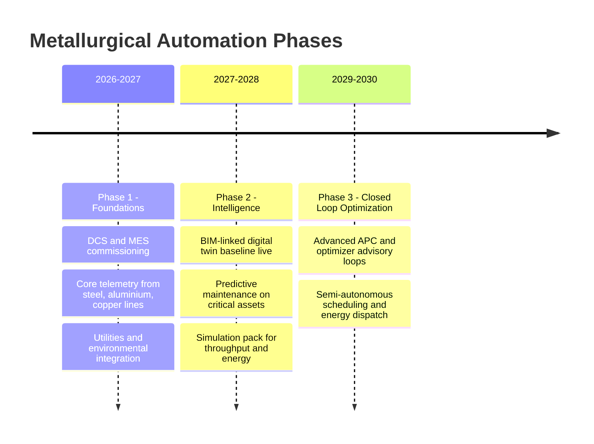

# Automation Roadmap

> **Factory:** Coo-Cah Metallurgical & Minerals Factory
> **Factory ID:** `CCH-MET`
> **Focus:** Metallurgical process automation, digital twin maturation, and simulation readiness

---

## 1. Phase Strategy

---

## 2. Gate 3 BIM + Simulation Execution Waves

### Wave A — BIM Readiness Baseline

- Freeze canonical naming (`Z1`-`Z14`, `DT-MET-*`, `ANC-MET-*`)
- Populate zone boundaries and asset anchors
- Map critical sensors to valid anchors
- Validate zero ID mismatches

### Wave B — Simulation Enrichment

- Expand sensor depth by line and failure mode
- Add quality and downtime context tags
- Add energy and environmental scenario variables
- Promote simulation templates for planning and operations

---

## 3. Acceptance Gates

### 3.1 Ready for BIM Viewer

- 100% primary assets have coordinates and orientation
- 100% critical sensors mapped to anchors
- No unresolved zone/asset/anchor ID mismatches
- BIM and sensor files meet required section/header structure

### 3.2 Ready for Simulation

- Steel, aluminium, copper, utilities, and environmental telemetry minima met
- Throughput, quality, downtime, and energy scenario inputs present
- Asset-to-process linkage complete and validated in MES/DT contracts

---

## 4. Governance and Operating Cadence

| Artifact | Single Owner | Backup Reviewer | Cadence |
| --- | --- | --- | --- |
| `docs/floor-plan.md` | Process Engineering Lead | Plant Engineering Manager | Monthly |
| `docs/bim/zone-boundaries.md` | BIM Coordinator | Process Engineering Lead | Monthly |
| `docs/bim/asset-anchors.md` | Digital Twin Engineer | OT Integration Lead | Weekly during rollout |
| `docs/sensor-map.md` | OT Instrumentation Lead | Digital Twin Engineer | Weekly during rollout |
| `docs/digital-twin.md` | Digital Manufacturing Lead | Programme PMO | Monthly |

Gate reviews are conducted at each Gate 3 checkpoint with owner sign-off.
