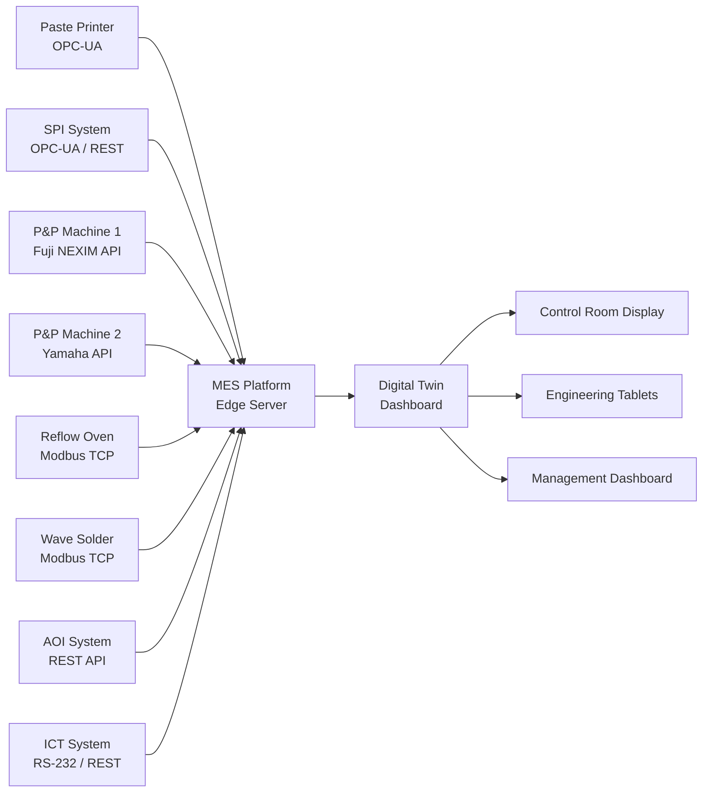
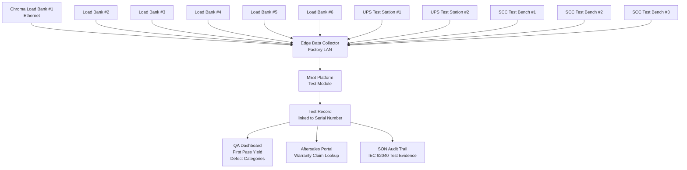
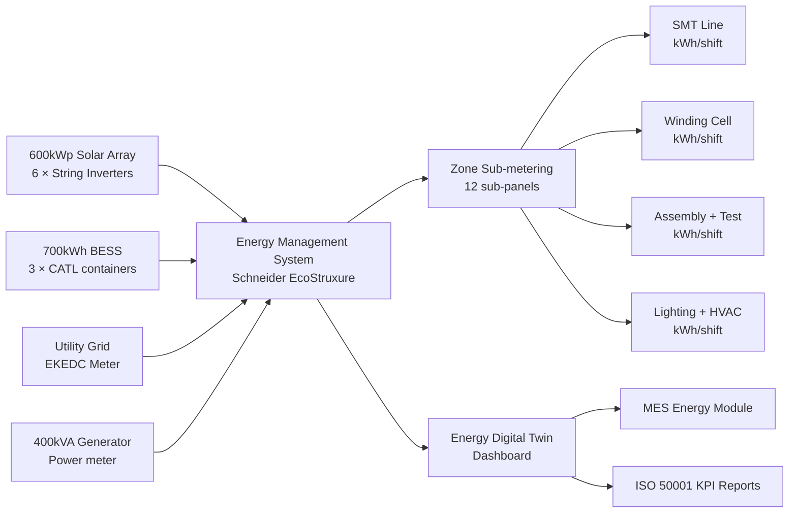

# Digital Twin

> **Factory:** Coo-Cah Garage & Power Electronics Factory — Sagamu, Ogun State  
> **Master Repo Ref:** [oumar-code/Coo-Kah-Doks](https://github.com/oumar-code/Coo-Kah-Doks) → `docs/standards/ai-platform.md`  
> **Platform:** Group-standard AI/IoT platform per master repo standards

---

## 1. Digital Twin Vision

The Coo-Cah Electronics Power Factory's digital twin is the virtual replica of the physical factory — updated in real time from sensor data, machine interfaces, MES records, and energy metering. Its purpose is threefold:

1. **Visibility:** See what is happening in the factory at any moment — production throughput, WIP, test results, energy consumption, equipment status
2. **Analysis:** Understand why things are happening — correlate quality defects with process variables, identify bottlenecks, track energy efficiency
3. **Optimisation:** Improve outcomes — predictive maintenance, process recipe optimisation, capacity simulation, energy self-sufficiency maximisation

The digital twin is a phased investment, growing from basic asset monitoring in Phase 1 to full factory simulation capability in Phase 3.

---

## 2. Asset Registry

### 2.1 Production Equipment Asset Register

All equipment in the digital twin is registered with a unique asset ID. Sensor data streams are linked to asset IDs. MES work orders reference asset IDs. Maintenance records are filed against asset IDs.

| Asset ID | Asset Name | Location (Zone) | DT Phase | Key Data Streams |
|---|---|---|---|---|
| CCG-EP-SMT-001 | Solder Paste Printer | Zone B — SMT | Phase 1 | Print alignment delta (X/Y/θ); squeegee pressure; print cycle time |
| CCG-EP-SMT-002 | SPI System | Zone B — SMT | Phase 1 | Paste height (3D point cloud per pad); pass/fail rate; defect trend |
| CCG-EP-SMT-003 | Pick & Place — High Speed | Zone B — SMT | Phase 1 | CPH (components per hour); feeder errors; nozzle change count; placement accuracy |
| CCG-EP-SMT-004 | Pick & Place — Flexible | Zone B — SMT | Phase 1 | As above; large component placement accuracy |
| CCG-EP-SMT-005 | Reflow Oven | Zone B — SMT | Phase 1 | Zone temperatures (all 10 zones vs setpoint); belt speed; O₂ level (if N₂ mode); power draw |
| CCG-EP-SMT-006 | Wave Solder | Zone B — SMT | Phase 1 | Solder pot temperature; wave height; preheat zone temps; conveyor speed |
| CCG-EP-SMT-007 | AOI System | Zone B — SMT | Phase 1 | Defect categories (by type, rate, trend); false call rate; panel throughput |
| CCG-EP-SMT-008 | ICT System | Zone B — SMT | Phase 1 | Test pass rate; fault categories; board throughput |
| CCG-EP-WND-001 | Toroidal Winding Machine #1 | Zone C — Winding | Phase 1 (basic); Phase 2 (full) | Phase 1: units/shift count; Phase 2 (CNC): tension, RPM, turn count per batch |
| CCG-EP-WND-002 | Toroidal Winding Machine #2 | Zone C — Winding | Phase 1 (basic); Phase 2 (full) | As above |
| CCG-EP-WND-003 | EI Core Winding Machine #1 | Zone C — Winding | Phase 1 (basic); Phase 2 (full) | Phase 1: units/shift; Phase 2: turns, wire tension, layer count |
| CCG-EP-WND-004 | EI Core Winding Machine #2 | Zone C — Winding | Phase 1 (basic); Phase 2 (full) | As above |
| CCG-EP-WND-005 | Vacuum Varnish Tank | Zone C — Winding | Phase 1 | Tank pressure (vacuum); cure temperature; batch ID |
| CCG-EP-WND-006 | Transformer Cure Oven | Zone C — Winding | Phase 1 | Temperature profile (ramp/soak/cool); alarm events |
| CCG-EP-ASM-001 | Inverter Assembly Conveyor | Zone D — Assembly | Phase 1 | Belt speed; station cycle time (per station); WIP count per station |
| CCG-EP-ASM-002 | Firmware Flash Station | Zone D — Assembly | Phase 1 | Flash count/hour; fail rate; firmware version mix |
| CCG-EP-ASM-003 | Laser Engraver | Zone D — Assembly | Phase 1 | Cycle count; marking quality check (vision) |
| CCG-EP-TST-001 | Load Bank #1 | Zone E — Test | Phase 1 | Real-time load (kW), voltage, current, THD, efficiency, temperature — all per serial number |
| CCG-EP-TST-002 | Load Bank #2 | Zone E — Test | Phase 1 | As above |
| CCG-EP-TST-003 | Load Bank #3 | Zone E — Test | Phase 1 | As above |
| CCG-EP-TST-004 | Load Bank #4 | Zone E — Test | Phase 1 | As above |
| CCG-EP-TST-005 | Load Bank #5 | Zone E — Test | Phase 1 | As above |
| CCG-EP-TST-006 | Load Bank #6 | Zone E — Test | Phase 1 | As above |
| CCG-EP-TST-007 | UPS Test Station #1 | Zone E — Test | Phase 1 | Transfer time (ms); battery runtime; input simulation events |
| CCG-EP-TST-008 | UPS Test Station #2 | Zone E — Test | Phase 1 | As above |
| CCG-EP-TST-009 | SCC Test Bench #1 | Zone E — Test | Phase 1 | MPPT tracking efficiency; charge voltage accuracy; temperature |
| CCG-EP-TST-010 | SCC Test Bench #2 | Zone E — Test | Phase 1 | As above |
| CCG-EP-TST-011 | SCC Test Bench #3 | Zone E — Test | Phase 1 | As above |
| CCG-EP-NRG-001 | Solar String Inverter #1 (100kW) | Inverter Room — Zone K | Phase 1 | DC power in, AC power out, efficiency, yield (kWh), MPPT operating point |
| CCG-EP-NRG-002 to 006 | Solar String Inverters #2–6 | Zone K | Phase 1 | As above |
| CCG-EP-NRG-007 | BESS Unit #1 (~233 kWh) | BESS Pad | Phase 1 | SoC %; charge/discharge power; cell temperature min/max; cycle count |
| CCG-EP-NRG-008 | BESS Unit #2 | BESS Pad | Phase 1 | As above |
| CCG-EP-NRG-009 | BESS Unit #3 | BESS Pad | Phase 1 | As above |
| CCG-EP-NRG-010 | Diesel Generator | Generator Yard | Phase 1 | Running hours; fuel level; output kW; alarm status |

### 2.2 AMR Fleet Asset Register

| Asset ID | AMR Unit | Platform | DT Data Streams |
|---|---|---|---|
| CCG-EP-AMR-001 to 012 | AMR Units #1–12 | Geek+ P40 | Position (x,y,θ) real-time; task status; battery SoC; load weight; fault status |

---

## 3. SMT Line Digital Twin (Phase 1)

### 3.1 Phase 1 Scope — Monitoring Dashboard

The Phase 1 SMT digital twin provides a real-time monitoring dashboard for the factory control room and engineering team. Data is pulled from machine APIs (typically REST/Modbus/MQTT) and displayed in the MES energy + production dashboard.

**Key SMT digital twin metrics (Phase 1):**
- OEE per machine (Availability × Performance × Quality)
- First-pass yield (FPY) by product, by shift, by operator
- Defect Pareto chart (by defect type; updated every hour)
- Reel consumption vs. production order (MES reconciliation)
- Reflow oven temperature profile — all zones, all shifts overlaid

### 3.2 Phase 2 Scope — Predictive and Closed-Loop

In Phase 2, the SMT digital twin gains predictive and closed-loop optimisation capabilities:

- **Reflow oven recipe optimisation:** Digital twin models PCB thermal mass; predicts optimal belt speed and zone temperature setpoints for new product introductions; reduces first-article profile runs from 3–5 attempts to 1–2
- **Predictive maintenance:** Reflow oven heating element degradation modelled from zone temperature delta history; P&P machine nozzle wear predicted from placement accuracy trend
- **SPC closed-loop:** Statistical process control on solder paste print volume (from SPI) automatically adjusts squeegee pressure on next board if trend detected

---

## 4. Winding Cell Digital Twin (Phase 2)

> **Phase 1:** Basic monitoring (units per shift; batch records). Full digital twin deployed in Phase 2 alongside CNC winding machine installation.

### 4.1 CNC Winding Machine Data Integration (Phase 2)

When CNC winding machines are installed in Phase 2, each machine provides:

| Data Stream | Protocol | Frequency | Use |
|---|---|---|---|
| Turns counter (running total) | OPC-UA | Real-time | Verify against programme specification; alert on discrepancy |
| Wire tension (mN) | OPC-UA | 10Hz | Tension profile per winding layer; detect wire break / tension anomaly |
| Spindle RPM | OPC-UA | 1Hz | Cycle time calculation; OEE |
| Programme ID | OPC-UA | Per batch | Link to MES work order; verify correct programme loaded |
| Fault codes | OPC-UA | On event | Immediate MES alert; maintenance dispatch |
| Layer count (complete) | OPC-UA | Per layer | Compare to specification; alert if layer count deviates |

**Winding batch record (digital):** Every transformer wound on a CNC machine has a complete digital record in MES: programme ID, wire lot number, turn count per layer, tension profile, operator who loaded the core, test result from transformer tester. This record is linked to the inverter serial number that uses the transformer.

### 4.2 Winding Cell OEE Dashboard

| KPI | Target | Measurement |
|---|---|---|
| Toroidal winding OEE | ≥ 75% (Phase 2 CNC) | Machine API → MES |
| EI winding OEE | ≥ 78% | Machine API → MES |
| Winding rework rate | < 0.5% (Phase 2 CNC) | Transformer tester results |
| Programme change-over time | < 5 minutes | MES timestamp |

---

## 5. Load Bank Test Data Integration

> **All load bank test data is automatically captured via Ethernet and permanently stored in MES against the unit serial number.** No manual data entry for test results.

### 5.1 Data Flow Architecture

### 5.2 Test Record Schema (per unit)

| Field | Example Value | Source |
|---|---|---|
| Serial number | CCG-INV-PSW-2K-2026-042891 | MES barcode scan at station entry |
| Product SKU | CCG-INV-PSW-2kVA | MES work order |
| Test date/time | 2026-11-15 14:32:07 | MES system clock |
| Test station | CCG-EP-TST-003 | Station ID |
| DC input voltage tested (V) | 24.0V (battery nominal) | Load bank instrument |
| AC output voltage (V RMS) | 230.2 V | Power analyser |
| AC output frequency (Hz) | 50.02 Hz | Power analyser |
| THD-V at full load (%) | 1.8% | Power analyser |
| Full load output (kW) | 1.98 kW | Load bank |
| Input DC current at full load (A) | 89.5 A | DC load/shunt |
| Conversion efficiency at full load (%) | 88.2% | Calculated (P_out/P_in) |
| No-load current draw (mA) | 420 mA | DC meter |
| Low battery cutoff voltage (V) | 21.2 V | Load bank sweep |
| High battery cutoff voltage (V) | 28.8 V | Load bank sweep |
| Overload trip time at 120% load (s) | 3.5 s | Load bank |
| Thermal image filename | SN042891_thermal_001.jpg | FLIR camera |
| Peak internal temperature (°C) | 64°C (MOSFET heatsink) | Thermal camera |
| Test result | PASS | Derived from all above |
| Operator ID | ENG-042 | MES login |
| Firmware version | CCG-INV-PSW-v2.3.1 | Read from unit via UART |

---

## 6. Energy Monitoring Digital Twin

The energy digital twin monitors all energy flows in the factory and feeds the ISO 50001 energy management KPIs.

### 6.1 Energy Dashboard (Real-Time)

### 6.2 Energy KPI Tracking

| KPI | Unit | Collection | Use |
|---|---|---|---|
| Solar generation (real-time) | kW / kWh/day | String inverter API | Self-sufficiency calculation |
| BESS state of charge | % / kWh | BESS BMS API | ATS decision logic; curtailment |
| Grid import/export | kW / kWh | Smart meter | Cost model; CO₂ intensity |
| Generator runtime | Hours | Generator controller | Fuel cost; maintenance scheduling |
| Energy per unit produced (inverter) | kWh/unit | MES (production count) ÷ metering | ISO 50001 energy intensity |
| CO₂ intensity | kg CO₂/kWh | Calculated (grid=0.43; gen=0.68; solar=0) | ESG reporting |
| Solar self-sufficiency (monthly) | % | Monthly calculation | Group energy KPI |
