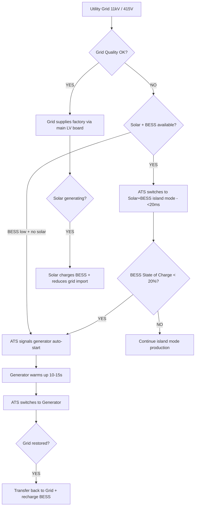

# Energy Profile

> **Factory:** Coo-Cah Garage & Power Electronics Factory — Sagamu, Ogun State  
> **Master Repo Ref:** [oumar-code/Coo-Kah-Doks](https://github.com/oumar-code/Coo-Kah-Doks) → `docs/standards/energy-strategy.md`

---

## 1. Site Energy Context — Sagamu, Ogun State

Sagamu Industrial Estate, Ogun State receives approximately **8–12 hours of grid supply per day** from the local DISCO (Ikeja Electric / EKEDC at time of planning). Grid outages are unpredictable and grid voltage is frequently unstable (170–240V swings common). For a precision electronics manufacturing facility where SMT reflow ovens, load bank testers, and transformer winding machines cannot tolerate power interruptions, total energy self-sufficiency during all production hours is a design requirement — not a cost-saving measure.

The **600 kWp ground-mount solar + 700 kWh LFP BESS** system is specifically sized to make the factory effectively grid-independent during all production shifts (06:00–22:00). The backup diesel generator covers night maintenance, worst-case cloudy days, and BESS depletion scenarios.

Solar irradiance data for Sagamu / Ogun State:

| Month | PSH/day | Monthly Energy from 600kWp (est.) |
|---|---|---|
| January | 4.6 | 82,800 kWh |
| February | 5.0 | 90,000 kWh |
| March | 4.8 | 86,400 kWh |
| April | 4.5 | 81,000 kWh |
| May | 4.3 | 77,400 kWh |
| June | 3.8 | 68,400 kWh |
| July | 3.6 | 64,800 kWh |
| August | 3.5 | 63,000 kWh |
| September | 4.0 | 72,000 kWh |
| October | 4.7 | 84,600 kWh |
| November | 4.9 | 88,200 kWh |
| December | 4.8 | 86,400 kWh |
| **Average** | **4.7** | **~78,750 kWh/month** |
| **Worst Month (Aug)** | **3.5** | **63,000 kWh/month** |

> PSH = Peak Sun Hours. Energy estimate assumes 600kWp array, performance ratio (PR) = 0.79, system efficiency losses ~21% (soiling, cables, inverter, temperature derating).

---

## 2. Factory Power Demand Analysis

### 2.1 Load Breakdown by Zone

| Zone | Key Equipment | Installed Load (kW) | Demand Factor | Running Load (kW) |
|---|---|---|---|---|
| SMT Line | Reflow oven (30kW), wave solder (18kW), P&P machines ×2 (6kW), SPI, AOI, ICT | 75 | 0.70 | 52 |
| Transformer Winding Cell | Winding machines, varnish oven (12kW), cure oven (15kW), lighting | 40 | 0.55 | 22 |
| Inverter Assembly Line | Conveyor, tools, presses, firmware flashers, HVAC | 35 | 0.60 | 21 |
| Load Bank Test Zone | Load banks ×6 (5kVA each), battery simulators, environmental chambers ×2 (18kW) | 65 | 0.65 | 42 |
| Power Tool Assembly | Presses, grinders, drills, testing equipment | 30 | 0.50 | 15 |
| Packaging Line | Carton erector, shrink wrapper, conveyors, labellers | 20 | 0.65 | 13 |
| Warehouse & Receiving | Forklifts (charging), lighting, dock levellers | 30 | 0.40 | 12 |
| AMR Fleet Charging | 12 × AMR 2.5kW chargers | 30 | 0.50 | 15 |
| Offices & Control Room | IT, MES servers, HVAC (offices), lighting | 25 | 0.80 | 20 |
| General Lighting & Services | Factory floor LED lighting, compressed air (37kW compressor) | 50 | 0.75 | 38 |
| Solar/BESS Inverter Losses | Auxiliary power for solar inverters, BESS, ATS | 15 | 1.00 | 15 |
| **Total** | | **415 kW** | | **~265 kW average / ~400 kW peak** |

**Estimated peak demand:** ~400 kW (all zones simultaneously at maximum demand during peak production shift)  
**Estimated average running load:** ~265 kW (weighted average across production hours)

### 2.2 Daily Energy Consumption

| Period | Hours | Average Load (kW) | Energy (kWh) |
|---|---|---|---|
| Production shift (06:00–22:00) | 16 h | 265 | 4,240 |
| Maintenance / night (22:00–06:00) | 8 h | 70 | 560 |
| **Total daily** | **24 h** | | **~2,800 kWh/day** |

> Note: Load bank testing of high-value units (inverters, UPS) consumes significant energy — approximately 150 kWh/day is "internal consumption" from testing loads. This is factored into the operating cost model.

### 2.3 Annual Energy Requirement

| Metric | Value |
|---|---|
| Production days/year | 250 (5 days/week, 50 weeks) |
| Non-production days/year | 115 (weekends + public holidays) |
| Production day consumption | ~2,800 kWh |
| Non-production day consumption | ~560 kWh (minimal maintenance loads) |
| **Annual energy requirement** | **~757,400 kWh/year (~757 MWh/year)** |

---

## 3. Solar PV System Design — 600 kWp Ground-Mount

### 3.1 Why Ground-Mount (not Rooftop)

| Consideration | Ground-Mount (Selected) | Rooftop |
|---|---|---|
| Structural impact | None — uses adjacent land east of building | Significant — requires structural engineering report; adds cost |
| Available area | ~5,000 m² east of building (flat, Sagamu industrial land) | ~8,000 m² roof available but load calculations needed |
| Panel tilt optimisation | Optimal tilt (10°) for Sagamu latitude (6.8°N) achievable | Constrained by roof pitch |
| Car park integration | Array provides shaded car parking — employee benefit | Not possible |
| Soiling / cleaning | Easier access for manual or automated cleaning | Requires safety harness or rope access |
| Expansion | Easy to add rows — land available for Phase 2 expansion | Limited by roof area |
| **Decision** | **Selected for Phase 1** | Fallback option if land plans change |

### 3.2 System Specification

| Parameter | Value |
|---|---|
| Total PV Capacity | 600 kWp |
| Panel Model (indicative) | Longi Hi-MO 6 LR5-72HTH-580M (580W, bifacial) or Canadian Solar HiHero 580W |
| Panel Count | ~1,035 panels (600,000W ÷ 580W per panel) |
| Array Configuration | 6 × string inverters (100kW each); ~173 panels per inverter; ~17 panels per string |
| MPPT Voltage Range | 600V–1,100V DC |
| Site Azimuth | South-facing (true south = 180°) — no buildings to south at Sagamu site |
| Panel Tilt | 10° (near-horizontal for low-latitude site; reduces wind loading) |
| Row Spacing | 4.0m inter-row to avoid self-shading at winter solstice sun angle |
| Ground Area Required | ~4,200 m² (including access paths) |
| Mounting Structure | Hot-dip galvanised steel ground-mount; 50-year design life |
| Performance Ratio (PR) | 0.79 estimated (soiling 3%, temperature derating 5%, cable losses 2%, inverter losses 4%, mismatch 2%, other 5%) |

### 3.3 Annual Solar Generation vs. Factory Demand

| Metric | Value |
|---|---|
| Annual solar generation (600kWp × 4.7PSH × 365 × PR 0.79) | ~813,000 kWh/year |
| Annual factory energy demand | ~757,000 kWh/year |
| Solar self-sufficiency ratio (generation ÷ demand) | **107%** (generation exceeds demand on annual basis) |
| Self-consumption ratio (accounting for curtailment and BESS limitations) | **~82%** |

> The system is intentionally oversized (~7% above annual demand) to account for worst-month (August) irradiance and to provide headroom for Phase 1 capacity ramp. Excess generation in dry season months can be exported to grid (if distribution agreement in place with EKEDC) or absorbed by battery charging.

---

## 4. Battery Energy Storage System (BESS) — 700 kWh LFP

### 4.1 BESS Sizing Rationale

| Requirement | Sizing Input |
|---|---|
| Cover full production shift without solar (fully cloudy day worst case) | 16h × 265kW avg = 4,240 kWh → impractical to cover fully; see below |
| Cover grid outage during production hours with solar backup | Solar: 600kWp × 0.4 (cloudy) = 240kW; deficit = 265–240 = 25kW; 700kWh covers 28h of deficit |
| Absorb peak solar excess (midday) and discharge through evening shift | 600kWp × 2h peak surplus ≈ 200kWh → fits within 700kWh usable (80% DoD = 560kWh usable) |
| Bridge grid-BESS transition (ATS switching) | <20ms transfer — seamless for SMT line and MES servers |
| Minimum runtime without any solar or grid (pure BESS, 265kW load) | 700kWh × 0.8 DoD ÷ 265kW = **~2.1 hours** emergency bridge |

**Design philosophy:** The BESS is not sized to run the factory for a full day — that is the generator's role. The BESS is sized to (a) absorb all midday solar surplus, (b) dispatch that energy through the production evening shift, and (c) bridge any short grid/solar interruptions without generator start.

### 4.2 BESS Specification

| Parameter | Value |
|---|---|
| Chemistry | LFP (Lithium Iron Phosphate) — preferred for industrial use; non-flammable; 6,000+ cycle life |
| Total Capacity | 700 kWh |
| Configuration | 3 × containerised BESS units (~233 kWh each) — BYD BBox Pro or CATL EnerC |
| Usable Capacity (80% DoD) | 560 kWh |
| Peak Discharge Rate | 0.5C = 350 kW (sufficient to support peak factory load) |
| AC Interface | 2 × 500kW bidirectional PCS (Sungrow or Huawei) |
| Siting | Outdoor concrete pad (shaded by solar array structure); minimum 3m clearance per NFPA 855 |
| Fire Suppression | FM-200 gaseous suppression inside each container (factory standard) |
| Operating Temperature | 0°C to +45°C (LFP chemistry; active thermal management within containers) |
| BMS | Built-in BMS with Modbus/CAN interface to energy monitoring system |
| Grid-Forming Capability | Yes — can maintain 400V / 50Hz bus in island mode when grid is absent |
| Warranty | 10 years / 6,000 cycles (minimum — vendor qualification criterion) |

---

## 5. Backup Generator

| Parameter | Value |
|---|---|
| Make/Model | Perkins 4016-61TRS2 or Cummins C440D5 (400kVA equivalent) |
| Rated Output | 400 kVA / 320 kW (prime rating) |
| Fuel | Diesel (EN 590 specification) |
| Tank Capacity | 1,500 litres (day tank + main tank; combined on-site) |
| Runtime at 40% load | ~60 hours (1,500L ÷ 25L/h consumption at 40% load) |
| Auto-Start | Yes — ATS signals auto-start within 15 seconds of grid failure and BESS low state |
| Exhaust | Above roofline; muffler and spark arrester; NESREA emissions compliance |
| Fuel Policy | Tank topped up to 100% every Monday; minimum 50% tank level enforced |
| Testing | Monthly no-load test (10 min); quarterly load test at 50% rated load |

---

## 6. Automatic Transfer Switch (ATS) Logic

**Priority order:** Solar+BESS → Grid → Generator  
**Transfer time:** <20ms (solar+BESS); <15 seconds (generator)  
**SMT line impact:** Zero interruption on solar+BESS switch. Generator transfer requires reflow oven soft-restart (automatic; 90-second oven recovery before new boards enter).

---

## 7. Energy Cost Model

### 7.1 Baseline (without solar/BESS — grid + generator only)

| Cost Item | Quantity | Unit Cost | Annual Cost |
|---|---|---|---|
| Grid electricity (8h/day × 250 days) | 530,000 kWh | ₦110/kWh | ₦58,300,000 |
| Generator fuel (16h/day × 250 days) | ~225,000 litres diesel | ₦1,050/litre | ₦236,250,000 |
| Generator maintenance (annual) | — | — | ₦8,500,000 |
| **Total baseline energy cost** | | | **₦303,050,000/year (~$188,000/year at ₦1,600/$)** |

### 7.2 With 600 kWp Solar + 700 kWh BESS

| Cost Item | Quantity | Unit Cost | Annual Cost |
|---|---|---|---|
| Grid electricity (residual, ~15% of demand) | ~113,600 kWh | ₦110/kWh | ₦12,496,000 |
| Generator fuel (~10% backup, bad weather weeks) | ~22,500 litres | ₦1,050/litre | ₦23,625,000 |
| Generator maintenance | — | — | ₦3,000,000 |
| Solar+BESS system O&M (~1.5% of CapEx/year) | — | — | ₦9,000,000 |
| **Total with solar+BESS** | | | **₦48,121,000/year (~$30,000/year)** |

### 7.3 Energy Investment Payback

| Metric | Value |
|---|---|
| Annual energy cost saving | ₦254,929,000/year (~$159,000/year) |
| Solar+BESS CapEx (600kWp + 700kWh) | ₦600,000,000 (~$375,000 at current rates) |
| Simple payback period | **2.35 years** |
| 10-year NPV of savings (8% discount rate) | **~₦1,710,000,000** |

> Energy cost assumptions: Grid tariff ₦110/kWh (Ogun State industrial Band A, 2025 estimate). Diesel ₦1,050/litre (Q1 2025 reference). Currency: ₦1,600/USD.

---

## 8. Energy KPIs and Monitoring

| KPI | Target | Monitoring Frequency |
|---|---|---|
| Solar self-sufficiency ratio | ≥ 80% monthly | Daily |
| BESS round-trip efficiency | ≥ 90% | Weekly |
| Generator runtime (% of total hours) | < 5% | Monthly |
| Energy intensity per unit produced (kWh/unit) | Inverter: ≤ 8.5 kWh/unit; SCC: ≤ 3.2 kWh/unit | Monthly |
| Carbon intensity (kg CO₂/kWh) | ≤ 0.08 (primarily solar) | Monthly |
| Grid import volume | < 15% of total demand | Monthly |
| PV array availability | ≥ 98% (excluding planned cleaning) | Weekly |
| BESS availability | ≥ 99% | Daily |

All energy KPIs feed into the MES energy dashboard and are reportable for ISO 50001:2018 (Phase 2 certification target). See [docs/mes-integration.md](./mes-integration.md).
