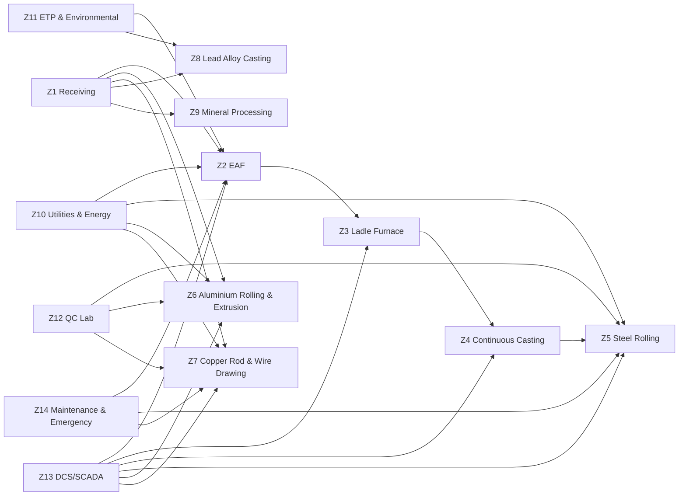

# Floor Plan & Layout

> **Factory:** Coo-Cah Metallurgical & Minerals Factory — Warri / Ovwian-Aladja, Delta State
> **Facility Area:** ~35,000 m²
> **Phase:** Phase 2 (BIM and simulation readiness baseline)

---

## 1. Canonical Zone Schema (Frozen for Gate 3)

All spatial, BIM, and sensor references must use this exact Zone ID set.

| Zone ID | Zone Name | Primary Process Area |
| --- | --- | --- |
| Z1 | Raw Material Receiving & Scrap Yard | Billet, scrap, ingot, cathode, and alloy input handling |
| Z2 | EAF & Primary Melting Bay | Electric arc furnace and charge handling |
| Z3 | Ladle Furnace & Secondary Refining | Ladle heating and chemistry correction |
| Z4 | Continuous Casting Bay | Billet/slab bloom casting |
| Z5 | Steel Rolling & Finishing | Rolling stands, cooling bed, and finishing |
| Z6 | Aluminium Rolling & Extrusion | Aluminium rolling and profile extrusion |
| Z7 | Copper Rod & Wire Drawing | CCR line and wire drawing lines |
| Z8 | Lead Alloy Casting | Lead alloy melt and grid casting |
| Z9 | Mineral Processing | Crushing, grinding, flotation, thickening |
| Z10 | Utilities & Energy | Substation, solar PV, BESS, compressors |
| Z11 | ETP & Environmental | Effluent treatment and environmental systems |
| Z12 | Quality Control Laboratory | Chemistry and mechanical test labs |
| Z13 | DCS/SCADA/IT Control Room | OT servers, historian, control desks |
| Z14 | Maintenance, Stores & Emergency | Workshops, spare stores, fire and emergency staging |

---

## 2. Zone Adjacency and Material Flow

---

## 3. Gate 3 Spatial Reference Rules

- Use `Z1`-`Z14` only; no alternate labels are allowed in BIM or sensor files.
- Every digital twin asset must be assigned to exactly one Zone ID.
- Every sensor record must reference a valid zone and a valid anchor in `docs/bim/asset-anchors.md`.
- Coordinate references for BIM are defined in `docs/bim/zone-boundaries.md`.
