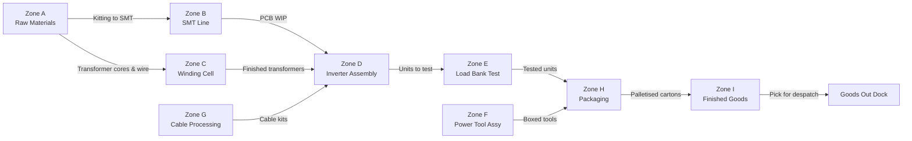

# Floor Plan & Layout

> **Factory:** Coo-Cah Garage & Power Electronics Factory — Sagamu, Ogun State
> **Total Facility Area:** ~12,000 m² (under-roof production + warehousing)
> **Site Area:** ~20,000 m² total (includes solar yard, generator, access roads, car park)
> **Master Repo Ref:** [oumar-code/Coo-Kah-Doks](https://github.com/oumar-code/Coo-Kah-Doks) → `factories/electronics/garage-power-electronics/floor-plan.md`

---

## 1. Site Overview

```text
┌──────────────────────────────────────────────────────────────────────────────────┐
│                            COO-CAH ELECTRONICS POWER FACTORY SITE                │
│                             Sagamu Industrial Estate, Ogun State                  │
│                                   (~20,000 m² total site)                         │
│                                                                                    │
│  ┌─────────────────────────────────────────────────────────┐                      │
│  │                   MAIN FACTORY BUILDING                  │   ╔═══════════════╗  │
│  │                     (~12,000 m²)                         │   ║ GROUND-MOUNT  ║  │
│  │   See Section 2 for internal layout                      │   ║ SOLAR ARRAY   ║  │
│  │                                                          │   ║  600 kWp      ║  │
│  │                                                          │   ║ (~4,200 m²)   ║  │
│  └─────────────────────────────────────────────────────────┘   ║  (east side)  ║  │
│                                                                  ╚═══════════════╝  │
│  ┌──────────────┐  ┌──────────────┐  ┌───────────────┐                            │
│  │  BESS PAD    │  │  GENERATOR   │  │   STAFF CAR   │                            │
│  │ 700 kWh LFP  │  │   YARD       │  │   PARK        │                            │
│  │  (3 units)   │  │ 400kVA Perks │  │ (under solar  │                            │
│  │  (~150 m²)   │  │ + 1,500L tnk │  │  shade)       │                            │
│  └──────────────┘  └──────────────┘  └───────────────┘                            │
│                                                                                    │
│  ┌──────────────────────────────────────┐  ┌───────────────────────────────────┐  │
│  │         GOODS IN / RECEIVING         │  │       GOODS OUT / DESPATCH        │  │
│  │         (loading dock ×3)            │  │       (loading dock ×2)           │  │
│  └──────────────────────────────────────┘  └───────────────────────────────────┘  │
│                                                                                    │
│                          [MAIN GATE & SECURITY]                                    │
└──────────────────────────────────────────────────────────────────────────────────┘
                                    ↑
                              Sagamu Road / Industrial Estate Access
```

---

## 2. Main Factory Building — Internal Layout (~12,000 m²)

### 2.1 Zone Map (Block Layout, not to scale)

```text
┌──────────────────────────────────────────────────────────────────────────────────────┐
│                          MAIN FACTORY FLOOR (~12,000 m²)                              │
│   ┌─────────────────────┐  ┌────────────────────────┐  ┌──────────────────────────┐  │
│   │  ZONE A: RAW MAT.   │  │   ZONE B: SMT LINE     │  │  ZONE C: WINDING CELL    │  │
│   │  WAREHOUSE          │  │                        │  │                          │  │
│   │  (~1,200 m²)        │  │  Paste printer → P&P   │  │  Toroidal winders ×2     │  │
│   │                     │  │  P&P → Reflow oven     │  │  EI/ETD winders ×2       │  │
│   │  Component racks    │  │  Wave solder           │  │  Bobbin winders ×4       │  │
│   │  ESD controlled     │  │  AOI + SPI + ICT       │  │  Inductor winders ×2     │  │
│   │  Humidity 45-55%RH  │  │  Depanelling           │  │  Varnish tank + cure oven│  │
│   │  Temp 20-25°C       │  │  ESD floor zone        │  │  Transformer test ×2     │  │
│   │                     │  │  (~1,000 m²)           │  │  (~800 m²)               │  │
│   └─────────────────────┘  └────────────────────────┘  └──────────────────────────┘  │
│                                                                                        │
│   ┌─────────────────────┐  ┌────────────────────────┐  ┌──────────────────────────┐  │
│   │  ZONE D: INVERTER   │  │  ZONE E: LOAD BANK     │  │  ZONE F: POWER TOOL      │  │
│   │  ASSEMBLY LINE      │  │  TEST ZONE             │  │  ASSEMBLY                │  │
│   │                     │  │                        │  │                          │  │
│   │  8-station conveyor │  │  Load banks ×6         │  │  Motor press ×2          │  │
│   │  Chassis prep       │  │  Battery simulators ×6 │  │  Assembly stations ×4    │  │
│   │  PCB mount          │  │  Power analysers ×4    │  │  Electrical test ×2      │  │
│   │  Transformer fit    │  │  Oscilloscopes ×4      │  │  Vibration test          │  │
│   │  Power device mount │  │  Hipot testers ×4      │  │  Label & pack            │  │
│   │  Bus bar + wiring   │  │  Environmental chmbrs  │  │  Isolated from           │  │
│   │  Firmware flash     │  │  UPS test station ×2   │  │  electronics area        │  │
│   │  Housing + seal     │  │  SCC test bench ×3     │  │  (metal swarf isolation) │  │
│   │  (~1,400 m²)        │  │  (~1,200 m²)           │  │  (~800 m²)               │  │
│   └─────────────────────┘  └────────────────────────┘  └──────────────────────────┘  │
│                                                                                        │
│   ┌─────────────────────┐  ┌────────────────────────┐  ┌──────────────────────────┐  │
│   │  ZONE G: CABLE &    │  │  ZONE H: PACKAGING     │  │  ZONE I: FINISHED GOODS  │  │
│   │  WIRE PROCESSING    │  │  LINE                  │  │  WAREHOUSE               │  │
│   │                     │  │                        │  │                          │  │
│   │  Wire cutting ×2    │  │  Carton erector        │  │  High-bay racking        │  │
│   │  Ferrule crimpers   │  │  Foam inserter         │  │  Racking for 3,000 pallets│  │
│   │  Harness boards ×6  │  │  Checkweigher          │  │  FIFO management         │  │
│   │  Cable labellers ×2 │  │  Label print-apply     │  │  Climate 18-28°C         │  │
│   │  Pull-force tester  │  │  Carton sealer         │  │  Fire suppression         │  │
│   │  (~500 m²)          │  │  Pallet wrapping       │  │  CCTV security           │  │
│   │                     │  │  (~600 m²)             │  │  (~1,500 m²)             │  │
│   └─────────────────────┘  └────────────────────────┘  └──────────────────────────┘  │
│                                                                                        │
│   ┌─────────────────────┐  ┌────────────────────────┐  ┌──────────────────────────┐  │
│   │  ZONE J: ANCILLARY  │  │  ZONE K: MAIN LV ROOM  │  │  ZONE L: OFFICES /       │  │
│   │  SERVICES           │  │  + INVERTER ROOM        │  │  CONTROL ROOM / QA LAB   │  │
│   │                     │  │                        │  │                          │  │
│   │  Compressor room    │  │  Main LV switchboard   │  │  MES Control Room        │  │
│   │  DI water system    │  │  Solar string inverters│  │  Quality laboratory      │  │
│   │  Nitrogen generator │  │  BESS PCS              │  │  Engineering offices     │  │
│   │  Solder waste store │  │  ATS panels            │  │  Training room           │  │
│   │  E-waste bay        │  │  Sub-distribution      │  │  Meeting rooms (×3)      │  │
│   │  Battery disposal   │  │  Energy monitoring     │  │  Reception               │  │
│   │  (~400 m²)          │  │  (~200 m²)             │  │  (~400 m²)               │  │
│   └─────────────────────┘  └────────────────────────┘  └──────────────────────────┘  │
└──────────────────────────────────────────────────────────────────────────────────────┘
```

---

## 3. Zone Area Summary

| Zone | Description | Area (m²) | Key Features |
| --- | --- | --- | --- |
| A | Raw Material Warehouse | 1,200 | ESD-controlled; humidity/temperature controlled; semiconductor cage; DG battery cage |
| B | SMT PCB Assembly Line | 1,000 | Full ESD floor; cleanroom-light (ISO Class 8 equivalent); positive pressure |
| C | Transformer & Inductor Winding Cell | 800 | Segregated for wire dust; varnish fume extraction; high-ceiling for oven stack |
| D | Inverter Assembly Line | 1,400 | 8-station conveyor; overhead compressed air + 24V power drops; MES terminals ×8 |
| E | Load Bank Test Zone | 1,200 | High power cabling (240V, 3-phase); ventilation for heat dissipation; Faraday screening on EMC scanner area |
| F | Power Tool Assembly | 800 | Isolated from electronics area; metal swarf containment; separate ventilation |
| G | Cable & Wire Processing | 500 | Cable drum stands; harness form boards; pull-force test area |
| H | Packaging Line | 600 | Carton and pallet flow; labels, accessories; AMR collection point |
| I | Finished Goods Warehouse | 1,500 | High-bay 6m racking; 3,000 pallet spaces; FIFO lanes per SKU; CCTV + access control |
| J | Ancillary Services | 400 | Compressor, DI water, nitrogen, e-waste bay, solder waste segregation |
| K | Main LV Room + Inverter Room | 200 | Electrical hazard zone; restricted access; fire suppression; server cabinet for MES edge |
| L | Offices / Control Room / QA Lab | 400 | MES control workstations; quality laboratory (calibrated instruments); management offices |
| **Total** | | **~10,000 m²** | *+2,000 m² internal circulation, plant rooms, toilets, first aid, fire exits* |

---

## 4. AMR Traffic Flow Plan

The 12-unit AMR fleet operates on defined virtual lanes within the factory. Key AMR routes:



AMR pathways are marked with virtual lanes (LiDAR map); pedestrian crossing zones have floor markings and audio-visual warnings. AMR speed: max 1.2 m/s in aisle; 0.3 m/s at pedestrian crossings.

---

## 5. Solar Yard — Ground-Mount Array

| Parameter | Value |
| --- | --- |
| Location | East side of main building |
| Area | ~4,200 m² (array footprint including paths) |
| Orientation | South-facing; 10° tilt |
| Row count | ~28 rows × 37 panels per row |
| Row width | 3.8m (panel + mounting frame) |
| Row spacing | 4.0m centre-to-centre (shade-free at winter sunrise 20° elevation) |
| Car park integration | Northern 10 rows elevated (2.8m clearance) for staff car parking — 60 spaces |
| Access paths | 2m concrete maintenance paths between every 4th row |
| Perimeter | 2.4m security fence + CCTV |
| Drainage | Sealed gravel base with perimeter French drain (Sagamu rainfall 1,400mm/year) |

---

## 6. BESS Pad

| Parameter | Value |
| --- | --- |
| Location | South-west corner of site (adjacent to main LV room) |
| Area | ~150 m² concrete pad |
| Units | 3 × containerised BESS (~233 kWh each) |
| Container footprint | 6.0m × 2.2m per unit (standard 20ft shipping container base) |
| Minimum clearance | 3m between containers and 3m to any building (NFPA 855) |
| Fire suppression | FM-200 in each container; container external fire panel |
| Security | Fenced and padlocked; CCTV; access only by authorised electrical staff |
| BESS PCS | 2 × 500kW PCS inverters mounted in weatherproof cabinet adjacent to containers |
| Cable routing | HV DC cables in conduit below grade from containers to PCS to LV room |

---

## 7. Building Services Summary

| Service | Specification |
| --- | --- |
| Structure | Steel portal frame; concrete floor slab; insulated profile metal roof + walls |
| Eaves Height | 8m (allows 6m racking in Zone I and forklift clearance) |
| Floor Loading | 10 kN/m² production zones; 15 kN/m² warehouse zones |
| Compressed Air | Atlas Copco GA37+ (37kW, 7bar, 6.5 m³/min); ring main throughout production floor |
| DI Water | 500L/day reverse osmosis + DI unit for SMT solder paste and PCB cleaning |
| HVAC — SMT & Winding | 10 ACH supply air; temperature 20–26°C; relative humidity 45–55% RH (SMT); winding area 40–60% RH |
| HVAC — Offices | 6 ACH; 22–24°C year-round; split systems (DAIKIN or equivalent) |
| Lighting — Production | LED high-bay (Philips BY570P or equivalent); 500 lux at workbench; 200 lux aisle |
| ESD Flooring | All SMT, winding, and inverter assembly zones: ESD vinyl (>10⁵ Ω surface resistivity) |
| Fire Protection | Wet pipe sprinkler (NFPA 13) throughout; FM-200 in LV room and server area; fire alarm addressable system |
| Security | CCTV (180° coverage); biometric access control on warehouse and LV room; perimeter fence + guard post |
| Effluent | Solder waste, varnish residue, and e-waste segregation bays; licensed waste contractor (NESREA-compliant) |
