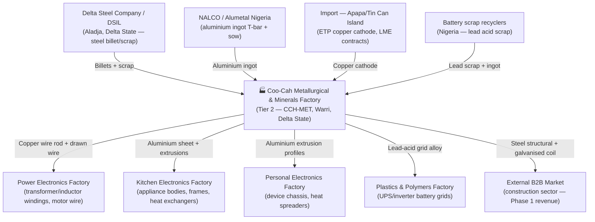

# Coo-Cah Metallurgical & Minerals Factory

> **Project Coo-Cah | AI-Powered Manufacturing Ecosystem**  
> **Vertical:** Chemicals — Steel processing, aluminium rolling, copper drawing, lead alloys  
> **Location:** Warri / Ovwian-Aladja Steel Corridor, Delta State, Nigeria  
> **Phase:** Phase 2  
> **Document Version:** 1.0 | **Status:** PLANNED

---

## Executive Summary

The Coo-Cah Metallurgical & Minerals Factory is the upstream materials platform for the wider
Coo-Cah manufacturing ecosystem. It is planned as a Phase 2 industrial facility in the
Warri / Ovwian-Aladja steel corridor, positioned to convert regional and imported metal inputs
into strategic feedstock for downstream factories and external B2B customers.

The plant is designed around four complementary metallurgical value streams:

- Steel processing for sheet coil, structural sections, galvanised coil, and stainless products
- Aluminium rolling and extrusion for sheet, coil, and industrial profiles
- Copper cathode conversion into wire rod and drawn wire for electrical manufacturing
- Lead alloy processing for battery grid applications and allied industrial use

This factory reduces import dependence on core industrial inputs, lowers FX exposure for
downstream Coo-Cah businesses, and creates a local manufacturing anchor in Delta State for
metal-intensive production.

---

## 1. Factory Overview

| Attribute | Detail |
| --- | --- |
| **Factory Name** | Coo-Cah Metallurgical & Minerals Factory |
| **Factory ID** | CCH-MET |
| **Repository** | `coo-cah-factory-chemicals-metallurgical` |
| **Location** | Warri / Ovwian-Aladja Steel Corridor, Delta State, Nigeria |
| **Vertical** | Chemicals |
| **Sub-Vertical** | Metallurgical — Steel, Aluminium, Copper, Lead Alloy |
| **Tier** | Tier 2 — Strategic Manufacturing |
| **Phase** | Phase 2 (Planning / Development) |
| **Status** | PLANNED |
| **Facility Area** | ~35,000 m² |
| **Peak Power Load** | ~2,500 kW |
| **Solar PV Target** | 1,000 kWp |
| **BESS Target** | 1,200 kWh LFP |
| **Employees (Phase 1)** | ~280 direct |
| **Quality Standards** | ISO 9001:2015, ISO 14001:2015, ISO 45001:2018, ISO 50001:2018, NESREA |
| **Master Repo** | [oumar-code/Coo-Kah-Doks](https://github.com/oumar-code/Coo-Kah-Doks) |
| **Template Version** | v1.0 |

---

## 2. Products — Phase 1 SKUs

| SKU Code | Product | Process | Priority |
| --- | --- | --- | --- |
| CCH-MET-001 | Steel sheet coil (0.5–3 mm CRCA) | Cold rolling mill | Phase 1 Start |
| CCH-MET-002 | Steel structural section (angle, channel, beam) | Structural rolling | Phase 1 Start |
| CCH-MET-003 | Aluminium sheet + coil (1050, 3003, 5052) | Aluminium rolling | Phase 1 Mid |
| CCH-MET-004 | Aluminium extrusion profiles (6060, 6063) | Extrusion press | Phase 1 Mid |
| **CCH-MET-005** | **Copper wire rod and drawn wire (ETP grade)** | **Wire drawing** | **Phase 1 Priority** |
| CCH-MET-006 | Galvanised steel coil (30–275 gsm coating) | Hot-dip galvanising | Phase 1 Late |
| CCH-MET-007 | Stainless steel sheet (304, 316) | Cold rolling + annealing | Phase 1 Late |
| CCH-MET-008 | Lead-acid battery grid alloy (Pb-Sb, Pb-Ca) | Alloy casting | Phase 1 Mid |

> **Priority focus:** CCH-MET-005 (copper wire rod) — highest intra-group demand from
> `coo-cah-factory-electronics-power` (transformer wire) and highest B2B market value.

---

## 3. Strategic Role in the Coo-Cah Ecosystem

This factory sits at the **industrial feedstock layer** of the Coo-Cah manufacturing stack.
Without domestically produced copper, aluminium, and steel, every downstream electronics,
appliance, and power factory faces import dependency and FX risk.

---

## 4. Strategic Suppliers

### 4.1 Delta Steel Company / DSIL — Tier A Critical

| Attribute | Detail |
| --- | --- |
| **Location** | Aladja, Delta State, Nigeria (adjacent to factory site) |
| **Significance** | Sole domestic source of steel billet and scrap within the Warri steel corridor |
| **Role** | Primary feedstock supplier for all steel rolling and structural section lines |
| **Strategy** | Long-term offtake agreement; priority allocation secured before production start; dual-scrap network (DSIL + independent Delta State scrap yards) maintained as backup |

### 4.2 ETP Copper Cathode — Import via Apapa (Tier A Critical)

| Attribute | Detail |
| --- | --- |
| **Location** | Apapa / Tin Can Island Port, Lagos (LME-registered smelters — Zambia, DRC, Chile) |
| **Significance** | No domestic ETP-grade copper cathode production exists in Nigeria; 100% import dependent |
| **Role** | Sole raw material input for copper wire rod drawing line (CCH-MET-005) |
| **Strategy** | LME-registered contract purchasing; 90-day safety stock (sea freight lead time + port clearance buffer); Form M + DFZ bonding strategy to manage FX and duty |

### 4.3 NALCO / Alumetal Nigeria — Tier A

| Attribute | Detail |
| --- | --- |
| **Location** | Nigeria (NALCO — national; Alumetal — Lagos/Port Harcourt distribution) |
| **Role** | Primary aluminium ingot (T-bar and sow) supply for rolling and extrusion lines |
| **Strategy** | Dual-source: NALCO domestic supply + import from Guinea (Guinea Alumina Corporation) via Apapa; 60-day safety stock maintained given sea freight lead time from West Africa |

---

## 5. Production Capacity Targets

| Product Category | Phase 1 (Yr 1–2) | Phase 2 (Yr 3–4) | Phase 3 (Yr 5+) | Unit |
| --- | --- | --- | --- | --- |
| Steel Sheet Coil (CRCA) | 40,000 | 90,000 | 180,000 | tonnes/year |
| Steel Structural Section | 25,000 | 60,000 | 120,000 | tonnes/year |
| Aluminium Sheet + Coil | 15,000 | 35,000 | 70,000 | tonnes/year |
| Aluminium Extrusion Profiles | 8,000 | 20,000 | 40,000 | tonnes/year |
| Copper Wire Rod + Drawn Wire | 12,000 | 28,000 | 55,000 | tonnes/year |
| Galvanised Steel Coil | 20,000 | 45,000 | 90,000 | tonnes/year |
| Stainless Steel Sheet | 5,000 | 12,000 | 25,000 | tonnes/year |
| Lead-Acid Battery Grid Alloy | 3,000 | 7,000 | 15,000 | tonnes/year |

---

## 6. Automation Phase Status

| Phase | Scope | Status |
| --- | --- | --- |
| **Phase 1** | DCS/SIS commissioning (Siemens PCS 7 or ABB 800xA), MES live, manual crane/handling, basic AI process monitoring, predictive maintenance pilot | In Planning |
| **Phase 2** | Automated coil handling (crane + coil car automation), AI rolling mill optimisation, digital twin live, automated QC (vision inspection), semi-autonomous furnace charging | Planned |
| **Phase 3** | Autonomous rolling parameters (DCS AI closed-loop), lights-out recoiling (nights), full predictive maintenance across all assets, AI alloy chemistry optimisation | Planned |

---

## 7. Energy Profile Summary

| Parameter | Value |
| --- | --- |
| Facility Area | ~35,000 m² |
| Estimated Peak Load | ~2,500 kW |
| Daily Energy Consumption | ~16,000 kWh/day (16h operational) |
| Recommended Solar PV | 1,000 kWp rooftop + partial ground-mount |
| Recommended BESS | 1,200 kWh LFP — high capacity for furnace inrush buffering |
| Warri Solar Irradiance | 5.0 Peak Sun Hours/day |
| Target Solar Self-Sufficiency | ≥ 70% |
| Annual CO₂ Avoidance (est.) | ~950 tonnes CO₂/year |
| Grid Connection | BEDC 33/11 kV dedicated HV supply |

---

## 8. Key Performance Indicators

| KPI | Target | Frequency |
| --- | --- | --- |
| OEE (Overall Equipment Effectiveness) | ≥ 72% (Phase 1) | Daily |
| Rolling Mill Yield | ≥ 96% (mass yield input→output) | Per Coil |
| Copper Drawing Yield | ≥ 97% | Per Lot |
| Product Defect Rate | < 2,500 ppm | Weekly |
| On-Time Delivery (intra-group) | ≥ 93% | Weekly |
| Energy Intensity (kWh/tonne product) | ≤ 450 kWh/tonne (steel); ≤ 380 kWh/tonne (Al) | Monthly |
| Solar Self-Sufficiency | ≥ 70% | Monthly |
| NESREA ETP Compliance | 100% | Monthly |
| MES Data Completeness | ≥ 95% | Daily |
| Safety Incidents | Zero LTI | Continuous |

---

## 9. Phase 1 Implementation Checklist

### Site & Legal

- [ ] Finalize land title and C of O for the Warri/Ovwian-Aladja site
- [ ] Complete geotechnical survey and boundary demarcation
- [ ] Execute EPC/owner-representative legal framework

### Regulatory & Permitting

- [ ] Submit and approve EIA with NESREA and Delta State authorities
- [ ] Secure development/building permits for heavy-industry operations
- [ ] Complete hazardous material and effluent handling permits

### Infrastructure & Utilities

- [ ] Confirm BEDC 33/11 kV dedicated HV interconnection scope
- [ ] Complete internal power distribution and substation civil works
- [ ] Commission industrial water, compressed air, and gas utility backbone

### Equipment Procurement

- [ ] Place purchase orders for rolling, extrusion, wire drawing, and galvanising lines
- [ ] Confirm FAT schedule and acceptance criteria with OEMs
- [ ] Complete import logistics and site delivery sequence plan

### Supplier Agreements

- [ ] Sign long-term offtake agreement with Delta Steel Company / DSIL
- [ ] Finalize LME-linked ETP copper cathode import contracts via Apapa
- [ ] Secure dual-source aluminium ingot contracts (NALCO / Alumetal + import backup)

### Certifications

- [ ] Launch ISO 9001:2015 QMS implementation program
- [ ] Launch ISO 14001:2015 and ISO 45001:2018 certification readiness
- [ ] Define product compliance pathway with SON and NESREA obligations

### Production Commissioning

- [ ] Complete cold commissioning for all Phase 1 process lines
- [ ] Execute hot commissioning and first production qualification batches
- [ ] Achieve stable 30-day run at target quality and safety metrics

---

## 10. Cross-Factory Dependencies

| Dependency Type | Factory | Material / Service | Direction |
| --- | --- | --- | --- |
| Output | Power Electronics Factory | Copper wire rod + drawn wire (transformer/motor windings) | Outbound |
| Output | Kitchen Electronics Factory | Aluminium sheet + coil (appliance bodies, frames, heat exchangers) | Outbound |
| Output | Personal Electronics Factory | Aluminium extrusion profiles (device chassis, bezels) | Outbound |
| Output | Plastics & Polymers Factory | Lead-acid battery grid alloy (Pb-Sb, Pb-Ca) | Outbound |
| Output | External B2B Market | Steel structural section, galvanised coil (construction) | Outbound |
| Input | Coo-Cah AI Platform | MES, Digital Twin, Process Analytics, DCS AI integration | Inbound |
| Input | Delta Steel Company (external Tier A) | Steel billet + heavy scrap | Inbound |
| Input | ETP copper cathode imports (LME) | Copper cathode (Apapa) | Inbound |

---

## 11. Documentation Index

| Document | Link | Notes |
| --- | --- | --- |
| Machinery & Equipment | [machinery.md](./machinery.md) | Core line equipment and technical specifications |
| Floor Plan & Layout | [floor-plan.md](./floor-plan.md) | Site zoning, flow paths, and area allocation |
| Energy Profile | [energy-profile.md](./energy-profile.md) | Load model, PV/BESS assumptions, and utility design |
| Automation Roadmap | [automation-roadmap.md](./automation-roadmap.md) | DCS, MES, AI, and digital twin rollout path |
| Supply Chain | [supply-chain.md](./supply-chain.md) | Upstream sourcing and downstream distribution strategy |
| Regulatory & Certification | [regulatory.md](./regulatory.md) | Compliance landscape and certification requirements |
| CAPEX & OPEX | [capex-opex.md](./capex-opex.md) | Capital and operating cost structure |
| MES Integration | [mes-integration.md](./mes-integration.md) | ISA-95 data structure and integration model |
| Digital Twin | [digital-twin.md](./digital-twin.md) | Twin architecture, simulation, and analytics scope |
| Implementation Plan | [implementation-plan.md](./implementation-plan.md) | Phase 2 implementation sequencing and gates |
| AI Platform Status | [ai-platform-status.md](./ai-platform-status.md) | AI endpoint readiness and deployment status |
| Penetration Test Scoping | [pentest-scoping.md](./pentest-scoping.md) | Security assessment scope, RoE, and remediation SLA |
| Gap Closure Report | [gap-closure-report.md](./gap-closure-report.md) | Supplementary-doc readiness closure tracking |
| Intra-Group Supply Coordination | [intragroup-supply-coordination.md](./intragroup-supply-coordination.md) | Confirmed inter-factory material commitments |
| MASTER_REPO_REF | [oumar-code/Coo-Kah-Doks](https://github.com/oumar-code/Coo-Kah-Doks) | Group-level documentation master repository |

---
*This document is part of the Coo-Cah Manufacturing Ecosystem documentation suite.*
