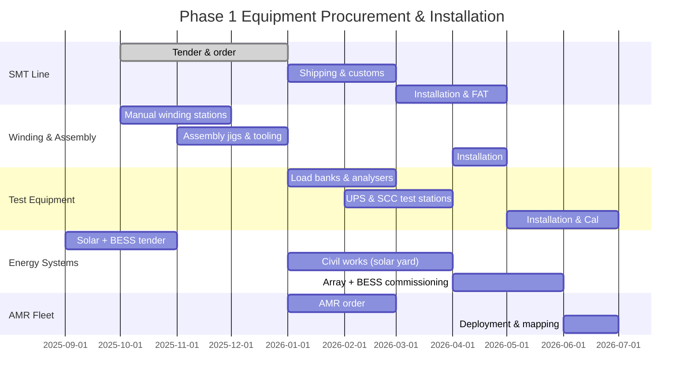

# Machinery & Equipment Register

> **Factory:** Coo-Cah Garage & Power Electronics Factory — Sagamu, Ogun State
> **Master Repo Ref:** [oumar-code/Coo-Kah-Doks](https://github.com/oumar-code/Coo-Kah-Doks) → `factories/electronics/garage-power-electronics/machinery.md`
> **Status:** PLANNED — Phase 1 equipment list; Phase 2 additions noted where applicable.

---

## 1. SMT (Surface Mount Technology) PCB Assembly Line

The SMT line produces all inverter control boards, MPPT/PWM solar charge controller boards, UPS control cards, power strip PCBs, and smart power strip Wi-Fi modules in-house. Phase 1 runs a single shift with capacity for a second shift as volume scales.

| # | Equipment | Make / Model (or Equivalent) | Qty | Key Specification | Zone |
| --- | --- | --- | --- | --- | --- |
| 1.1 | Solder Paste Printer (SPI-integrated) | DEK Horizon 03iX or Ekra X5 | 1 | ±15 µm print accuracy; auto-PCB alignment; inline SPI | SMT Zone |
| 1.2 | Solder Paste Inspection (SPI) | Koh Young KRIA 3D or Viscom S3088 | 1 | 100% inline 3D paste height inspection | SMT Zone |
| 1.3 | Pick-and-Place Machine — High Speed | Fuji NXT III or Juki RX-7R | 1 | Up to 72,000 cph; 01005–55mm² components | SMT Zone |
| 1.4 | Pick-and-Place Machine — Flexible/Large Components | Yamaha YSM40R or ASM SIPLACE SX | 1 | Large connectors, electrolytic caps, power semiconductors; 0402–150mm | SMT Zone |
| 1.5 | Reflow Oven (10-zone lead-free) | Heller 1913 MK5 or BTU Pyramax 150N | 1 | 10 heating zones; nitrogen option; max 380°C; 1.8m/min belt | SMT Zone |
| 1.6 | Wave Soldering Machine | Ersa POWERFLOW e N2 | 1 | Lead-free solder; nitrogen atmosphere; through-hole and SMT mixed | SMT Zone |
| 1.7 | Automated Optical Inspection (AOI) — Post-Reflow | Koh Young Zenith Ultra or Mirtec MV-9 | 1 | 15 MP colour camera; 3D measurement; inline/offline | SMT Zone |
| 1.8 | In-Circuit Tester (ICT) | Keysight i3070 or Digitaltest PILOT | 1 | 512-pin bed-of-nails; flying probe option | SMT Zone |
| 1.9 | Selective Soldering Machine | Ersa VERSAFLOW 3/45 | 1 | For mixed-technology boards with THT islands | SMT Zone |
| 1.10 | PCB Depanelling Router | YSCUT-T1 or LPKF ProtoLaser | 1 | Routing and V-cut; 0.05mm positional accuracy | SMT Zone |
| 1.11 | SMT Component Storage Tower | Mycronic MX Tower or equivalent | 2 | Smart reel storage; MES-integrated; humidity-controlled | SMT Zone |
| 1.12 | Nitrogen Generator | Parker domnick hunter (4 Nm³/h) | 1 | 99.999% N₂ purity; supplies reflow oven and wave solder | Utilities |

**SMT line throughput target (Phase 1):** Up to 800 PCB panels/shift on a mixed-product schedule.
**ESD protocol:** Full ESD-controlled floor from tape-cutting to finished board store — wrist straps, ESD flooring, ionisers.

---

## 2. Transformer & Inductor Winding Section

> **Critical note:** Transformer and inductor winding is the **most labour-intensive and precision-demanding manufacturing operation** in this factory. Every inverter, UPS, and solar charge controller contains at least one custom-wound magnetic component. Phase 1 is entirely manual winding with jigs and fixtures. Phase 2 deploys CNC winding machines — the single biggest productivity improvement in the factory.

| # | Equipment | Make / Model (or Equivalent) | Qty | Key Specification | Zone |
| --- | --- | --- | --- | --- | --- |
| 2.1 | Toroidal Core Winding Machine | ACME HW-800 or Jovil Universal Coil Winder | 2 | Manual-assist toroidal winder; 0–200 RPM; torque control; guides 0.1–4.0mm wire | Winding Cell |
| 2.2 | EI/ETD Core Bobbin Winding Machine | Gorman Machine Corp BW-6 or Aotewell BW-2000 | 2 | Bobbin winder with layer counter; traversing guide; 0.05–6.0mm wire | Winding Cell |
| 2.3 | Heavy-Gauge Bobbin Winder (power transformer) | Acme BW-1200 or equivalent | 4 | For high-current primary windings; 1.0–10.0mm wire; torque tension control | Winding Cell |
| 2.4 | Inductor Air-Core Winder | Gorman IC-4 or Aotewell AL-500 | 2 | Air-core inductors for inverter output filters; 0.5–3.0mm wire; mandrel set | Winding Cell |
| 2.5 | Vacuum Varnish Impregnation Tank | HEDSON IMPREX 200L or Meier Prozesstechnik | 1 | 200L; vacuum + pressure impregnation; Class F polyester varnish | Winding Cell |
| 2.6 | Transformer Oven (post-varnish cure) | Binder FD series 240 L, 200°C | 1 | Forced-air circulation; 240L; Class F cure cycle | Winding Cell |
| 2.7 | Transformer Test Station | Chroma 19501 or HV Instruments TTR-101 | 2 | Turns ratio, insulation resistance, hipot (3kVAC), inductance, DC resistance | Winding Cell / Test |
| 2.8 | Wire Gauge / Tension Measurement Station | Mitutoyo MDH-25M or equivalent | 2 | Micrometer + tension meter; go/no-go gauge board for all wire grades | Winding Cell |
| 2.9 | Core Storage Rack (ESD-safe, humidity-controlled) | Custom fabrication | 4 | Ferrite + silicon-steel core storage; 55–60% RH controlled area | Winding Cell |

**Phase 2 upgrade:** 2 × CNC toroidal winding machines (e.g., Jovil CNC-1600 or Gorman CNC-900) and 2 × CNC bobbin winding machines replace manual winders. CNC winding reduces winding labour by ~65% and improves inter-turn consistency to ±0.5% turns.

---

## 3. Inverter Assembly Line

Each inverter assembly station is a balanced-flow line with conveyor linking 8 stations. MES tracks WIP at every station. Every unit receives a unique serial number at Station 1 that follows the unit to despatch.

| # | Station | Equipment / Tooling | Description |
| --- | --- | --- | --- |
| 3.1 | Chassis Prep | Pneumatic press, drill press, nibbling tool | Aluminium/steel chassis punching, gland holes, ventilation slots |
| 3.2 | PCB Mount & Harness | Anti-static assembly bench, torque screwdrivers (Raimondi), cable-form jigs | Mount control PCB, power PCB, gate driver board; route internal harness |
| 3.3 | Transformer Integration | Gantry lift (max 25kg), anti-vibration mounts, torque wrenches | Install toroidal/EI transformer; secure with anti-vibration bushings |
| 3.4 | Power MOSFET / IGBT Mount | Thermal-compound dispenser, pneumatic screwdriver, heatsink jig | Apply thermal compound; mount power devices to heatsink; torque to spec |
| 3.5 | Bus Bar & Terminal Wiring | Wire stripper/crimper station, hydraulic lug crimper (up to 95mm²) | DC input bus, AC output terminals, battery terminals; terminal torque |
| 3.6 | Firmware Flash & Serial Engraving | JTAG/SWD programmer (ST-Link V3), barcode scanner, laser engraver | Flash firmware; record FW version + serial number in MES; laser serial on chassis |
| 3.7 | BMS Programming (where applicable) | BMS programmer, USB-UART adapter | Programme BMS parameters (charge voltage, cutoff, temp limits) per SKU |
| 3.8 | Housing & Sealing | Torque screwdriver set (Raimondi or equivalent), IP-gasket press | Fit housing halves, front panel, terminal cover; IP rating check |
| 3.9 | Load Bank Pre-Test Connection | Poka-yoke cable harness, DC and AC load bank cables | Connect to load bank test station (see Section 4); unit stays in jig during test |
| 3.10 | Packaging & Label Print | Carton erector, foam inserter, auto-labeller (Zebra ZT411 or equivalent) | Box, accessories, QR-linked warranty card; SON C-Mark label applied |

**Conveyor:** Flat-belt low-voltage conveyor, 15m total length, variable speed 0.1–0.5m/min, WIP carriers with barcode ID.

---

## 4. Load Bank & Test Equipment

> **Policy (non-negotiable):** Every inverter, UPS, solar charge controller, and battery charger produced in this factory is **100% tested on load banks before packaging**. No unit ships untested. This is the core quality guarantee and warranty foundation.

| # | Equipment | Make / Model | Qty | Specification | Purpose |
| --- | --- | --- | --- | --- | --- |
| 4.1 | Programmable AC Load Bank | Chroma 63800 Series or NH Research 4600 | 6 | 0–5 kVA; resistive + inductive + capacitive; PF 0–1; THD analysis | Inverter full-load testing |
| 4.2 | DC Electronic Load (battery simulator) | Chroma 63200A or BK Precision 8616 | 6 | 0–150V, 0–120A, 1800W; CC/CV/CR/CP modes | Simulate battery for inverter DC input testing |
| 4.3 | Power Quality Analyser | Fluke 435-II or Hioki PW3390 | 4 | 4-channel; THD-I/V; harmonics to 50th; true RMS; EN 50160 | Verify sine wave quality; THD-V <3% (PSW requirement) |
| 4.4 | Digital Storage Oscilloscope | Rigol DS1054Z or Keysight DSOX1204G | 4 | 4-channel; 100 MHz; 1 GSa/s; FFT | Waveform inspection, switching noise analysis |
| 4.5 | Hipot / Dielectric Tester | Chroma 19053 or Phenix Technologies AC/DC | 4 | AC 0–5 kVAC; DC 0–6 kVDC; insulation resistance to 10 GΩ | IEC 62040-1 safety test (3kVAC, 1 minute, creepage/clearance) |
| 4.6 | UPS Test Station | NH Research 9200 or Chroma UPS ATE | 2 | Simulates mains input, battery, and load; transfers time measurement | IEC 62040-3 classification testing (VFI/VI/VFD) |
| 4.7 | SCC (Solar Charge Controller) Test Bench | Custom (PV simulator + battery simulator + load) | 3 | 0–200V PV source, 0–120V battery, MPPT tracking efficiency test | IEC 61683 efficiency and MPPT performance validation |
| 4.8 | Battery Charger Test Station | Chroma 17020 or custom | 2 | 12/24/48V; CC/CV/float stage verification; ripple measurement | CCG-BC multi-stage charge profile validation |
| 4.9 | EMC Near-Field Scanner | Langer RF-R 50-1 or Tekbox TBPS01 | 1 | Near-field E + H probes; 100kHz–3GHz; pre-compliance EMC screening | Pre-NCC/SON EMC screening before formal lab submission |
| 4.10 | Thermal Camera | FLIR E86 or Hikmicro M30 | 2 | 640×480 IR; ±2°C accuracy; real-time MES image capture | Thermal profile at full load — all power stages |
| 4.11 | Environmental Chamber (burn-in) | ESPEC SH-241 or Weiss WK3 180/40 | 2 | –20°C to +70°C; 20–95% RH; 180L | 8-hour burn-in cycle at +55°C full load (high-value SKUs) |

**Load bank test data** is captured via Ethernet to MES. Each unit's test record (voltage, current, THD, efficiency, transfer time, temperature) is permanently linked to its serial number. See [docs/mes-integration.md](./mes-integration.md).

---

## 5. Power Tool Assembly Line

Power tools (drills, angle grinders, circular saws) are assembled on a dedicated line separated from the electronics area to isolate metal swarf.

| # | Equipment | Qty | Description |
| --- | --- | --- | --- |
| 5.1 | Press-fit Station (motor + gearbox) | 2 | Hydraulic press, 10-tonne; press-fit armature into gear housing |
| 5.2 | Torque Assembly Station | 4 | Pneumatic torque screwdrivers; all fasteners torqued to drawing spec |
| 5.3 | Brush & Commutator Inspection Bench | 2 | Optical magnification; commutator run-out gauge (max 0.05mm TIR) |
| 5.4 | Electrical Safety Tester | 2 | Hipot 1.5kVAC; insulation resistance; earth continuity; IEC 60745-1 |
| 5.5 | No-Load Speed Test Bench | 2 | RPM measurement; current draw at no-load; grinder guard test |
| 5.6 | Vibration Test Station | 1 | IEC 60745-2 vibration emission measurement; 3-axis accelerometer |
| 5.7 | Label Print & Apply | 1 | SON C-Mark, CE (export), safety warnings in English + Yoruba/Hausa |
| 5.8 | Carton Packing Station | 2 | Box, foam inserts, accessories, manual, warranty card |

---

## 6. Cable & Wire Processing

| # | Equipment | Make / Model | Qty | Specification |
| --- | --- | --- | --- | --- |
| 6.1 | Automatic Wire Cutting & Stripping Machine | Schleuniger EcoStrip 9380 or Komax Zeta 645 | 2 | 0.5–35mm²; strip length ±0.5mm; up to 6,000 cuts/h |
| 6.2 | Hydraulic Ferrule / Lug Crimper | Klauke EP20 or BURNDY PAT32 | 2 | 0.5–120mm² crimps; go/no-go pull test |
| 6.3 | Cable Harness Board | Custom (plywood form-board with pins) | 6 | Per-model harness form-boards; cables routed and clipped before installation |
| 6.4 | Cable Label Printer | Brady BMP71 or Panduit MP300 | 2 | Heat-shrink and self-laminating labels; wire ID per IEC 60445 |
| 6.5 | Pull-Force Tester | Mecmesin MultiTest-i 1kN | 1 | Verify crimp pull force (≥ 80N for 1.5mm²; per IEC 60228 requirement) |

---

## 7. AMR Fleet — Autonomous Mobile Robots

| Attribute | Value |
| --- | --- |
| Fleet Size | 12 units (Phase 1) |
| Platform | Geek+ P40 Series or equivalent (1,000 kg payload per unit) |
| Function | Kitting delivery to assembly stations; WIP transport between zones; empty carton return; raw material replenishment |
| Navigation | LiDAR SLAM; no floor tape required; auto-updates map after layout changes |
| MES Integration | AMR fleet management system (FMS) integrated with MES via REST API; task auto-generation when MES signals BOM pull |
| Charging | Autonomous docking; lithium-ion on-board; 8h operation per charge; opportunity charging during breaks |
| Safety | ISO 3691-4 compliant; LiDAR + ultrasonic collision avoidance; pedestrian detection; emergency stop mushroom |

---

## 8. Packaging Line

| # | Equipment | Qty | Description |
| --- | --- | --- | --- |
| 8.1 | Carton Erector (automatic) | 1 | Forms flat-pack cartons; output 600 cartons/h |
| 8.2 | Foam-in-Place / Die-Cut Foam Insert Machine | 1 | Custom foam inserts for inverter and UPS models; protects during transport |
| 8.3 | Weigh-Check Scale | 2 | Inline checkweigher; verifies all accessories present; ±5g accuracy |
| 8.4 | Automatic Label Applicator | 2 | Zebra ZT411 print-and-apply; prints SON C-Mark, serial barcode, model, CE/export marks |
| 8.5 | Carton Sealer (tape) | 1 | Top + bottom tape sealer; adjustable for carton sizes |
| 8.6 | Shrink Wrapper (pallet) | 1 | Pallet stretch-wrap turntable; 20 pallets/h |
| 8.7 | Pallet Labeller | 1 | Pallet GS1-128 labels; links to MES despatch module |

---

## 9. Energy Systems Equipment

| # | Equipment | Make / Model | Qty | Specification | Location |
| --- | --- | --- | --- | --- | --- |
| 9.1 | Ground-Mount Solar PV Array | Longi Hi-MO 6 or Canadian Solar HiHero (600W panels) | ~1,000 panels | 600 kWp total; bifacial panels; ground-mount steel frame | Solar Yard (east of building) |
| 9.2 | Solar Inverter / String Inverter | Huawei SUN2000-100KTL or SMA Tripower Core1 110 kW | 6 | 100kW per unit; 600V–1100V MPPT range | Inverter Room |
| 9.3 | Battery Energy Storage System (BESS) | CATL EnerC or BYD BBox Pro 300kWh (×3 units) | 3 units (=700kWh) | 700 kWh total LFP; containerised; BMS; 0.5C discharge rate | BESS Pad (outdoor, shaded) |
| 9.4 | BESS Inverter / Bidirectional PCS | Sungrow SC1000UD or Huawei LUNA2000 PCS | 2 | 500kW PCS per unit; grid-forming capability | BESS Pad |
| 9.5 | Automatic Transfer Switch (ATS) | Socomec ATYS 3e 630A | 2 | 3-phase ATS; Grid / Solar+BESS / Generator priority switching | Main LV Board |
| 9.6 | Backup Diesel Generator | Perkins 4016-61TRS2 400kVA or equivalent | 1 | 400kVA / 320kW; 1,500L tank; auto-start on ATS signal; ~60h runtime at 40% load | Generator Yard |
| 9.7 | Energy Monitoring System | Schneider EcoStruxure Power or ABB Ability Ellipse | 1 | Real-time kW/kWh per zone; PV yield; BESS SoC; integrated with MES energy dashboard | Control Room |
| 9.8 | Main LV Switchboard | Schneider Prisma or ABB Formula | 1 | 2000A, 400V; metered sub-circuits per factory zone; power factor correction | Main LV Room |

---

## Equipment Procurement Timeline (Phase 1)

---

*All equipment specifications are subject to competitive tendering. Equivalent models from approved vendors (as per Coo-Cah Procurement Standards in master repo) are acceptable. See [docs/capex-opex.md](./capex-opex.md) for cost estimates.*
