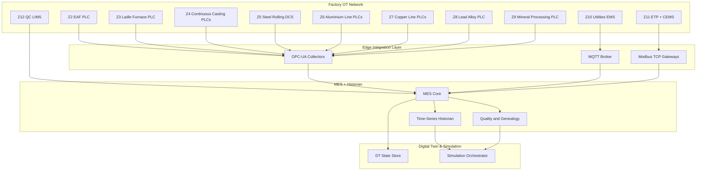

# MES Integration

> **Factory:** Coo-Cah Metallurgical & Minerals Factory
> **Factory ID:** `CCH-MET`
> **Integration Scope:** Metallurgical process lines, utilities, environment, and digital twin feed

---

## 1. Integration Architecture

---

## 2. Canonical Data Contract Rules

| Rule | Requirement |
| --- | --- |
| Asset key | Must use `DT-MET-*` IDs from `digital-twin.md` |
| Zone key | Must use `Z1`-`Z14` IDs from `floor-plan.md` |
| Timestamp | UTC ISO 8601 with millisecond precision |
| Units | SI units only; unit field mandatory |
| Quality flag | Every point must include quality (`good`, `bad`, `uncertain`) |

---

## 3. Minimum Telemetry for Simulation Readiness

| Process Domain | Minimum Signals | Simulation Use |
| --- | --- | --- |
| Steel (Z2-Z5) | Melt temp, casting speed, rolling speed, gauge, torque, downtime | Throughput, yield, bottleneck analysis |
| Aluminium (Z6) | Billet temp, ram pressure, profile speed, gauge | Capacity and quality drift scenarios |
| Copper (Z7) | Rod diameter, draw speed, wire tension, break count | Breakage risk and output optimization |
| Environmental (Z11) | ETP pH/flow, NOx/SO2/PM trends | Compliance and constraint modeling |
| Utilities (Z10) | Power import, PV output, BESS SoC, compressed air pressure | Energy cost and dispatch simulation |

---

## 4. Event Triggers to Digital Twin

- Work-order start/stop
- Equipment state change (run, idle, fault)
- Quality out-of-spec event
- Energy threshold breach
- Environmental threshold breach

These trigger simulation jobs for what-if and corrective-action scenarios.
