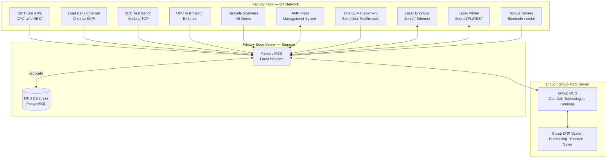
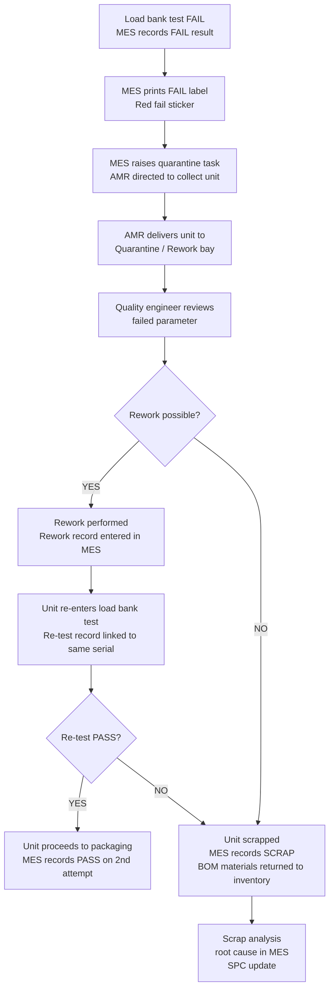

# MES Integration

> **Factory:** Coo-Cah Garage & Power Electronics Factory — Sagamu, Ogun State  
> **Master Repo Ref:** [oumar-code/Coo-Kah-Doks](https://github.com/oumar-code/Coo-Kah-Doks) → `docs/standards/mes-integration-standards.md`  
> **MES Platform:** Group-standard MES (per master repo) — deployed from Day 1

---

## 1. MES Architecture Overview



**Network topology:** Factory OT (Operational Technology) network is physically separated from corporate IT network. A DMZ firewall with one-way data diode allows MES data to flow from OT to IT but prevents inbound connections to production equipment from corporate or external networks.

---

## 2. Serial Number Traceability System

### 2.1 Serial Number Format

| Field | Format | Example |
| --- | --- | --- |
| Factory prefix | CCG-EP (Coo-Cah Garage — Electronics Power) | CCG-EP |
| Product family | 3–4 char SKU abbreviation | INV-PSW |
| Power rating / size | Numeric | 2K |
| Year of manufacture | 4-digit year | 2026 |
| Sequential unit number | 6-digit, zero-padded | 042891 |
| **Full serial format** | CCG-EP-{SKU}-{SIZE}-{YYYY}-{NNNNNN} | **CCG-EP-INV-PSW-2K-2026-042891** |

### 2.2 Serial Number Assignment and MES Linkage

Serial numbers are assigned by the MES at the moment a unit enters the assembly line. The number is:

- Linked to the **production work order** (which product, which batch)
- Linked to **all BOM component lot numbers** (which reel of MOSFETs, which transformer core batch, which enclosure batch)
- Linked to **the PCB assembly record** (which SMT panel, which AOI/ICT result)
- Linked to **the winding cell record** (which transformer batch, which winding programme)
- Linked to **the firmware flash record** (firmware version, flash timestamp, flash station)
- Linked to **the full load bank test record** (all electrical measurements — see Section 4)
- Linked to **the SON label print record** (label printed, label applied confirmation)
- Linked to **the despatch record** (to which customer or internal factory)

**This creates a complete, unbreakable chain of custody for every unit's entire commercial life.**

### 2.3 QR Code on Product and Packaging

Every CCG product has a QR code on the rear label and on the outer carton. Scanning the QR code directs to the Coo-Cah warranty portal showing:

| Information | Visible to Customer | Visible to Coo-Cah Service Team |
| --- | --- | --- |
| Product model and rating | ✅ | ✅ |
| Serial number | ✅ | ✅ |
| Date of manufacture | ✅ | ✅ |
| Firmware version | — | ✅ |
| Factory test result summary (PASS) | ✅ | ✅ (full data) |
| Warranty expiry date | ✅ | ✅ |
| Distributor / customer name | — | ✅ |
| Service history (if any repairs) | — | ✅ |

---

## 3. IEC 62040 Test Records in MES

### 3.1 Why IEC 62040 Test Records Must Live in MES

For SON NIS certification and ISO 9001:2015 compliance, every inverter and UPS unit must have a documented test record proving it met IEC 62040 safety and performance requirements before leaving the factory. Paper test records are:

- Prone to loss
- Not searchable for warranty claims
- Not auditable by SON without factory visit
- Cannot be accessed by Coo-Cah aftersales team remotely

**MES-stored digital test records solve all of these.** The SON audit team can be given read-only access to the test record portal during factory audits.

### 3.2 Mandatory Test Parameters Stored (Inverter / UPS per IEC 62040)

| Test Parameter | Standard Reference | Pass Criterion | Stored in MES? |
| --- | --- | --- | --- |
| AC output voltage at full load | IEC 62040-3 | 230V ±5% (218–242V) | ✅ |
| AC output frequency | IEC 62040-3 | 50Hz ±0.5Hz | ✅ |
| THD-V at full load (pure sine wave) | IEC 62040-2 / NIS 411 | < 3% THD-V | ✅ |
| Conversion efficiency at full load | IEC 62040-3 | ≥ 85% (2kVA), ≥ 88% (5kVA) | ✅ |
| Low battery cutoff voltage | Coo-Cah spec + IEC 62040 | Within ±0.2V of nominal | ✅ |
| Overload trip test (120% load) | IEC 62040-3 | Trip within 10 seconds | ✅ |
| Dielectric withstand (Hipot) | IEC 62040-1 Annex I | 3kVAC, 1 minute, no breakdown | ✅ |
| Insulation resistance | IEC 62040-1 | ≥ 2MΩ (500V DC Megger) | ✅ |
| Transfer time (UPS only) | IEC 62040-3 | ≤ 4ms (VI classification) | ✅ |
| Battery runtime at full load (UPS only) | IEC 62040-3 | ≥ rated minutes per spec | ✅ |
| No-load input current | Internal spec | ≤ 500mA (2kVA) | ✅ |
| Peak chassis temperature at full load | ISO 9001 / warranty requirement | ≤ 70°C (accessible surface) | ✅ (thermal image attached) |
| Firmware version | Traceability requirement | Must match released FW for SKU | ✅ |
| Test PASS/FAIL result | — | PASS | ✅ |
| Test operator ID | — | — | ✅ |
| Test date and time | — | — | ✅ |

### 3.3 Test Record Retention Policy

| Retention Period | Reason |
| --- | --- |
| **10 years minimum** (after unit despatch) | Warranty period (2 years) + potential product liability claims (8 years additional) |
| Backup policy | MES database backed up daily to cloud storage; 90-day local backup + 10-year cloud archive |
| SON audit access | SON-authorised personnel can request read access to test records portal for certification audits |

---

## 4. Load Bank Ethernet Integration

### 4.1 Load Bank Communication Protocol

The Chroma 63800 series load banks (and equivalent models) communicate via **IEEE 488.2 / SCPI over Ethernet (LXI compliant)**. The MES edge server acts as the SCPI controller.

**Test sequence automation:**

```
MES sends to Load Bank via SCPI:
  1. UNIT:SCAN <serial_number>           -- associates test to unit
  2. LOAD:MODE RESISTIVE                 -- set load type
  3. LOAD:LEVEL 1980                     -- set 99% of rated load (W)
  4. MEAS:VOLT?                          -- measure output voltage
  5. MEAS:CURR?                          -- measure output current
  6. MEAS:POW?                           -- measure output power
  7. MEAS:FREQ?                          -- measure output frequency
  8. MEAS:THD?                           -- measure THD-V
  9. CALC:EFF?                           -- calculate efficiency (with DC input meter)
  10. THERMAL:TRIGGER                    -- trigger FLIR camera capture
  11. LOAD:LEVEL 2376                    -- 120% overload
  12. MEAS:TRIP:TIME?                    -- measure overload trip time
  13. TEST:RESULT?                       -- get pass/fail judgement
  14. DATA:EXPORT <serial_number>        -- push full test record to MES API
```

**Automated test cycle time:** ~8 minutes per inverter unit (including 5-minute thermal stabilisation under full load).

### 4.2 Failure Handling

If a unit fails any test parameter:



---

## 5. SON Label Print-and-Apply Integration

### 5.1 Label Content and Compliance

Each product label is printed by the Zebra ZT411 label printer at the packaging station. The MES sends the print job to the printer via ZPL (Zebra Programming Language) over network.

**Label fields populated from MES (per unit):**

| Label Field | Source |
| --- | --- |
| Product name (e.g., "Pure Sine Wave Inverter 2kVA") | MES product master |
| SKU code (CCG-INV-PSW-2K) | MES product master |
| Serial number (text + Code 128 barcode) | MES serial number |
| QR code (URL to warranty portal with serial) | MES — generated per unit |
| Firmware version | MES — from firmware flash record |
| Date of manufacture (MM/YYYY) | MES — from production work order |
| "Made in Nigeria" declaration | MES product master |
| Manufacturer name and address | MES product master |
| SON C-Mark logo | Stored in ZPL template in Zebra printer |
| NIS certificate number | MES product master (updated when certificate issued) |
| NIS standard number (e.g., NIS 411:2020) | MES product master |
| Input/output specifications | MES product master |
| Safety warnings (IEC-required) | ZPL label template |
| CE mark (for export-labelled units) | MES — flag per order |
| Ratings: voltage, current, frequency, IP class | MES product master |

### 5.2 Label Print Control

**Poka-yoke:** The MES will only generate a print job for a SON label if:

1. The unit's serial number has a **PASS** load bank test record in the database
2. The unit's serial number has a **completed** firmware flash record
3. The current NIS certificate is **valid** (not expired) for this product

If any condition is not met, MES blocks the label print and raises an alert. This prevents units from being labelled and packaged before they are fully tested and certified.

---

## 6. MES Modules Summary

| MES Module | Key Functions | Priority |
| --- | --- | --- |
| Production Planning | Work orders; BOM explosion; capacity planning; shift scheduling | Phase 1 Day 1 |
| Inventory Management | GRN; FIFO; lot tracking; expiry alerts; safety stock alerts | Phase 1 Day 1 |
| Shop Floor Control | Station traveller cards; operator login; time recording; WIP tracking | Phase 1 Day 1 |
| Quality Management | AOI/ICT results; load bank results; transformer test results; NCR management | Phase 1 Day 1 |
| Serial Traceability | Serial number assignment; full genealogy; QR code generation | Phase 1 Day 1 |
| Label Management | ZPL template management; print queue; SON compliance validation | Phase 1 Day 1 |
| Energy Monitoring | Solar yield; BESS SoC; grid import; generator hours; energy per unit | Phase 1 Day 1 |
| AMR Integration | Task dispatch; fleet position; battery status; utilisation | Phase 1 Day 1 |
| Despatch & Shipping | Packing list; delivery note; SON C-Mark shipment record; customer order link | Phase 1 Day 1 |
| Warranty Portal | Serial lookup; test record view; aftersales team access | Phase 1 (before first sale) |
| Reporting & Analytics | OEE; FPY; yield trends; energy KPIs; inventory turns; financial reconciliation | Phase 1 Day 1 |
| Predictive Maintenance | Equipment sensor monitoring; maintenance scheduling (Phase 2 AI upgrade) | Phase 2 |
| Digital Twin Integration | Real-time machine data feeds to digital twin platform | Phase 1 (basic); Phase 2 (full) |
