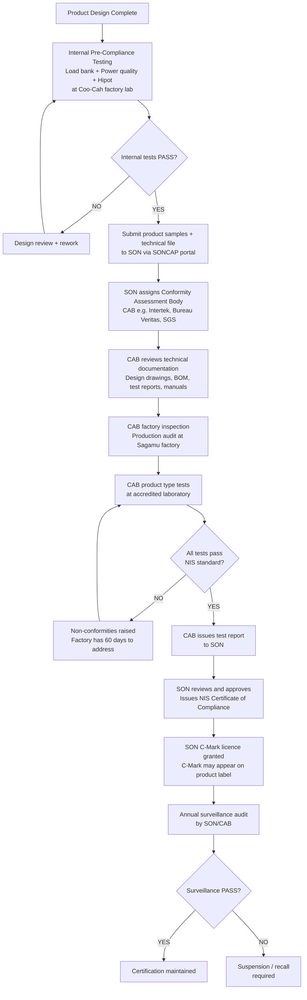
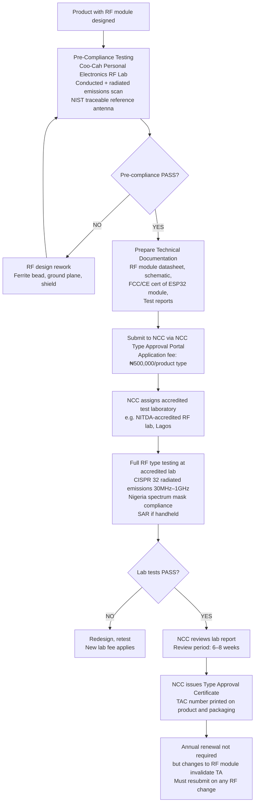
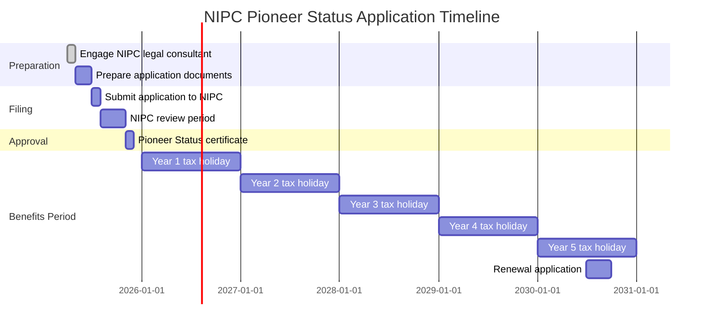

# Regulatory & Certification

> **Factory:** Coo-Cah Garage & Power Electronics Factory — Sagamu, Ogun State  
> **Master Repo Ref:** [oumar-code/Coo-Kah-Doks](https://github.com/oumar-code/Coo-Kah-Doks) → `docs/standards/iso-requirements.md`

---

## 1. Regulatory Bodies Overview

| Body | Full Name | Jurisdiction | Relevance to This Factory |
|---|---|---|---|
| **SON** | Standards Organisation of Nigeria | Federal | Mandatory product certification (NIS standards); C-Mark on all products |
| **NCC** | Nigerian Communications Commission | Federal | Type Approval for all Wi-Fi and RF-enabled products |
| **NESREA** | National Environmental Standards and Regulations Enforcement Agency | Federal | Factory EIA; e-waste take-back; VRLA battery disposal |
| **Nigeria Customs Service** | — | Federal | Form M for all controlled imports; SON CoC for product imports |
| **NIPC** | Nigerian Investment Promotion Commission | Federal | Pioneer Status application — 5-year CIT holiday |
| **NAFDAC** | — | Federal | Not applicable for power electronics products |
| **Ogun State EPA** | Ogun State Environmental Protection Agency | State | State-level environmental permits; effluent standards |

---

## 2. SON (Standards Organisation of Nigeria) — NIS Certification

### 2.1 SON Certification Process Flowchart

### 2.2 NIS Standards by Product

| Product | NIS Standard | Equivalent International | Key Test Requirements |
|---|---|---|---|
| CCG-INV-PSW / CCG-INV-MSW | NIS 411 | IEC 62040-1/2/3 (UPS/Inverter) | Safety, EMC, output waveform quality, efficiency |
| CCG-SCC-MPPT / CCG-SCC-PWM | NIS (IEC 61683 adoption) | IEC 61683 | MPPT tracking efficiency ≥ 93%; temperature coefficient; safety |
| CCG-PS Smart Power Strip | NIS 120 / NIS 197 | IEC 60884-1 (socket outlets) | Mechanical endurance (10,000 cycles), current rating, pull-out force |
| CCG-UPS | NIS (IEC 62040 adoption) | IEC 62040-1/2/3 | Safety, transfer time, run time, EMC |
| CCG-BC Battery Charger | NIS | IEC 60335-2-29 | Safety; charging efficiency; overcharge protection |
| CCG-PT-DRILL / CCG-PT-AG / CCG-PT-CS | NIS (IEC 60745 adoption) | IEC 60745-1/-2-1/-2-3 | Safety, vibration emission, mechanical hazards |

### 2.3 SON C-Mark Requirements on Product Label

Every product sold in Nigeria must bear the SON C-Mark. Label requirements:

| Element | Requirement |
|---|---|
| SON C-Mark logo | As per SON artwork guidelines; must be of minimum size |
| NIS certificate number | Printed on label |
| Standard number | e.g., "NIS 411:2020" |
| "Made in Nigeria" | Mandatory for locally manufactured products |
| Manufacturer name and address | Coo-Cah Garage & Power Electronics Factory, Sagamu, Ogun State |
| Serial number | Unique per unit — laser engraved + barcode |
| Date of manufacture | Month/Year |
| Safety warnings | As per applicable IEC standard requirements |

---

## 3. IEC Standards — Technical Breakdown

### 3.1 IEC 62040 — UPS and Inverter Standards (Three Parts)

#### IEC 62040-1: Safety Requirements

Tests and requirements:
| Clause | Requirement | Test Method |
|---|---|---|
| Electric shock protection | No live parts accessible; creepage and clearance distances to Table 1 | Visual inspection + measurement |
| Energy hazard | Capacitor stored energy — discharge to <2J within 1s of power off | Measured discharge time |
| Thermal hazard | Max surface temperature 70°C (accessible surfaces) | Thermocouple under full load at max ambient |
| Fire protection | Internal components to comply with UL94 V-1 minimum; enclosures V-0 | Needle flame test |
| Insulation | Dielectric withstand: 3kVAC 1 minute, 50Hz; no breakdown | Hipot test per Annex I |
| Overcurrent protection | Fuse or circuit breaker sized to transformer / wiring capacity | Documentation + test |
| Labels and markings | Input/output voltages, current, frequency, IP rating clearly marked | Visual inspection |

#### IEC 62040-2: Electromagnetic Compatibility (EMC)

| Class | Application | Limits |
|---|---|---|
| Class C1 | Residential — CCG-INV-PSW models for home use | Conducted emissions: CISPR 22 Class B; Radiated: 30m measurement |
| Class C2 | Industrial — CCG-UPS rack-mount in server rooms | Conducted emissions: CISPR 22 Class A; less stringent radiated |
| Immunity | All products | IEC 61000-4-2 ESD, 4-4 EFT/Burst, 4-5 Surge, 4-11 Voltage dips |

**NCC pre-compliance testing:** Before formal EMC certification, the **Coo-Cah Personal Electronics Factory RF Lab** performs near-field and conducted emissions pre-compliance screening. This catches major emissions issues before expensive accredited lab tests. Pass-rate at formal lab improved from industry-average 45% first-time pass to >85% using this pre-screening approach.

#### IEC 62040-3: Performance Classification

IEC 62040-3 classifies UPS by behaviour during input power disturbances:

| Classification | Type | Transfer Time | Coo-Cah Product |
|---|---|---|---|
| VFI (Voltage and Frequency Independent) | Online double-conversion | 0ms (zero) | Future Phase 2 online UPS |
| VI (Voltage Independent) | Line interactive | ≤ 4ms | **CCG-UPS Line Interactive (Phase 1)** |
| VFD (Voltage and Frequency Dependent) | Offline / standby | ≤ 20ms | Low-cost segment (not Phase 1 focus) |

CCG-UPS Line Interactive target: VI classification; transfer time ≤ 4ms; this is the industry standard for IT equipment protection.

---

### 3.2 IEC 61683 — Solar Charge Controller Efficiency

Key requirements for CCG-SCC-MPPT certification:

| Test | Requirement | Coo-Cah Target |
|---|---|---|
| MPPT tracking efficiency | ≥ 93% (ratio of actual harvested power to theoretical maximum) | ≥ 96% (competitive advantage) |
| Conversion efficiency | ≥ 93% (PV input to battery output) | ≥ 95% |
| Temperature coefficient | Operating range –20°C to +60°C; efficiency derating < 0.3%/°C | Tested in environmental chamber |
| Self-consumption | < 10mA standby current | Measured with precision ammeter |
| Overcharge protection | Battery charge cutoff to within ±0.1V of setpoint | Test at all three voltage systems (12V/24V/48V) |
| Reverse polarity protection | No damage from reverse PV or battery connection | Physical test |

---

### 3.3 IEC 60745-1 / IEC 60745-2 — Power Tool Safety

| Standard | Product | Key Requirements |
|---|---|---|
| IEC 60745-1 | All power tools (general) | Electrical insulation, thermal protection, mechanical hazards, commutator sparking |
| IEC 60745-2-1 | CCG-PT-DRILL | No-load speed accuracy; spindle runout; chuck retention |
| IEC 60745-2-3 | CCG-PT-AG | Guard effectiveness; disc burst containment; brake (spindle stop < 3s) |
| IEC 60745-2-5 | CCG-PT-CS | Blade guard; splitter/riving knife; kickback test; blade replacement safety |

Vibration emission test (IEC 60745-1 Clause 20): Required for all handheld tools. Vibration values must be declared in product manual. Test uses calibrated 3-axis accelerometer on prescribed workpiece material.

---

### 3.4 IEC 60884-1 — Socket Outlets and Smart Power Strips

| Requirement | Test |
|---|---|
| Contact retention force | Pin pull-out force ≥ 5N for BS plug pins (Nigerian standard SABS 164-2 / BS 1363) |
| Mechanical endurance | 10,000 insertion/withdrawal cycles; contact resistance ≤ 5mΩ after cycling |
| Earthing continuity | Earth contact resistance ≤ 0.1Ω during test |
| Temperature rise | < 45K rise above ambient at rated current for 1 hour |
| Overload protection | Fuse or thermal cutout; rated correctly for 4/6/8 way configuration |

**Wi-Fi module in CCG-PS (NCC Type Approval — see Section 4):** The smart switching relay and Wi-Fi module add requirements beyond IEC 60884-1.

---

## 4. NCC Type Approval — Wi-Fi Products

### 4.1 Products Requiring NCC Type Approval

| Product | RF Feature | NCC Requirement |
|---|---|---|
| CCG-PS Smart Power Strip | Wi-Fi 2.4GHz (ESP32 module); individual relay switching app | Type Approval Certificate |
| CCG-INV-PSW (Wi-Fi models) | Wi-Fi 2.4GHz monitoring and control app | Type Approval Certificate |

### 4.2 NCC Type Approval Process

**ESP32 module advantage:** The Espressif ESP32-WROOM-32E module already holds FCC/CE/SRRC certifications as a module. NCC Type Approval primarily tests the complete product (in its enclosure, with its antenna placement). Using a pre-certified RF module significantly reduces Type Approval risk and cost.

**Coo-Cah RF Lab:** The pre-compliance RF lab at the Coo-Cah Personal Electronics Factory performs near-field scanning and basic conducted emissions testing. Products passing pre-compliance at this lab have an >85% first-time pass rate at formal NCC accredited labs, saving significant time and cost.

---

## 5. NESREA — Environmental Compliance

### 5.1 Environmental Impact Assessment (EIA) — Pre-Construction

| Requirement | Details |
|---|---|
| Regulatory basis | NESREA Act 2007; EIA Act (CAP E12 LFN 2004) |
| Trigger | Factory construction and significant industrial operations |
| Process | Engage licensed EIA consultant; scoping study → draft EIA → public consultation → NESREA review → approval |
| Timeline | 6–12 months from engagement to approval; must be obtained before groundbreaking |
| Key study areas | Noise (winding machines, compressors); chemical hazards (solder flux, varnish solvents); e-waste generation; stormwater runoff; traffic impact |
| Ogun State EPA | Simultaneous filing with Ogun State EPA; state permit required in addition to Federal NESREA approval |

### 5.2 E-Waste Take-Back Scheme

NESREA requires all manufacturers of electronic equipment to operate a product take-back and e-waste recycling programme.

| Requirement | Coo-Cah Implementation |
|---|---|
| Regulatory basis | National Environmental (Electrical/Electronic Sector) Regulations 2011 |
| Take-back obligation | Manufacturer responsible for end-of-life recovery of own products |
| Collection mechanism | Coo-Cah aftersales centre (Sagamu) accepts returned end-of-life units; collection points at major distributors |
| Recycling partner | Licensed e-waste recycler (NESREA-registered) — contracted before first product sale |
| Annual reporting | Annual e-waste report to NESREA: tonnes collected, tonnes recycled, recycling partner |

### 5.3 VRLA Battery Disposal Plan

VRLA (lead-acid) batteries in UPS units are classified as hazardous waste requiring licensed disposal.

| Element | Requirement |
|---|---|
| Regulatory basis | NESREA Hazardous Waste Management Regulations; Basel Convention (Nigeria is signatory) |
| Disposal agent | Must be NESREA-registered lead-acid battery recycler |
| Disposal method | Lead recovery smelting at licensed facility; no landfill |
| Consumer take-back | CCG-UPS packaging includes instruction to return dead batteries to Coo-Cah or authorised point |
| Documentation | Chain of custody documents for every batch of batteries transferred to recycler |
| NESREA annual report | Quantity disposed (kg), recycling company, NESREA permit number |
| Phase 2 transition | Evaluate LiFePO₄ batteries — eliminates lead disposal obligation; classified as non-hazardous |

### 5.4 Solder and Chemical Waste Management

| Waste Type | Source | Disposal Method |
|---|---|---|
| Solder dross (lead-free SnAgCu) | Wave solder machine | Licensed metals recycler (solder dross has recoverable tin value) |
| Solder paste waste | SMT printer purges | Sealed container; hazardous waste contractor |
| Varnish solvent waste | Winding cell varnish tank | NESREA-registered solvent waste contractor |
| Flux residue | PCB cleaning | Neutralised; industrial effluent disposal |
| Capacitor waste (electrolytic) | Rework/scrap | E-waste recycler |

---

## 6. Nigeria Customs — Import Compliance

| Requirement | Details |
|---|---|
| Form M | Required for all imports above $2,000 FOB value; filed through commercial bank before shipment |
| SON Certificate of Conformity (CoC) | Required for semiconductors, electronic components, and any finished electronic products imported — SONCAP or PVOC scheme |
| Pre-Shipment Inspection | For goods above $5,000: inspection at origin by SON-approved CAB (SGS, Intertek, Bureau Veritas) |
| Import duty | Electronic components (semiconductors, passives): generally 0–5% under ECOWAS CET; transformer cores: 5–10% |
| Value Added Tax | 7.5% VAT on all imports (rebatable against output VAT) |
| Customs agent | Licensed customs agent required; Coo-Cah to engage specialist electronics import agent (e.g., Bolloré Logistics, Maersk Nigeria) |

---

## 7. NIPC Pioneer Status Application

### 7.1 Benefits

| Benefit | Details |
|---|---|
| Corporate Income Tax (CIT) holiday | 5 years (renewable) — 100% CIT exemption |
| Withholding tax on dividends | 0% during pioneer period |
| Capital allowances | Preserved; can be carried forward to post-pioneer period |
| Import duty | Pioneer Status does not grant import duty exemption; separate application to FIRS required |
| Estimated tax saving (Phase 1) | Based on projected pre-tax profit of ~₦800M in Year 3–5: ~₦240M saved over 5-year period |

### 7.2 Eligibility Criteria

| Criterion | Coo-Cah Status |
|---|---|
| Sector: manufacturing | YES — power electronics manufacturing |
| Renewable energy manufacturing | YES — solar charge controllers, MPPT; eligible under NIPC Gazette Notice |
| New investment (not acquired business) | YES — greenfield factory |
| Minimum CapEx | ₦100M minimum; Coo-Cah target CapEx Phase 1: ~₦4.5B — far exceeds threshold |
| Nigerian incorporation | YES — Coo-Cah Technologies Holdings Nigeria Ltd |

### 7.3 Application Process and Timeline

### 7.4 Required Documents

| Document | Status |
|---|---|
| Certificate of Incorporation (CAC) | Available — Coo-Cah Technologies Holdings |
| Memorandum and Articles of Association | Available |
| Feasibility/Business Plan | To prepare — this repository documents serve as basis |
| Three-year financial projections | To prepare — see [docs/capex-opex.md](./capex-opex.md) |
| Evidence of funding (bank statements/facility letters) | To prepare |
| Technical description of manufacturing process | To prepare — this repository documents serve as basis |
| Evidence of land acquisition | To obtain upon site selection |

---

## 8. ISO Certification Roadmap

| Certification | Standard | Phase Target | Scope |
|---|---|---|---|
| Quality Management System | ISO 9001:2015 | **Phase 1 (by Q4 2027)** | All manufacturing, test, and supply chain processes |
| Occupational Health & Safety | ISO 45001:2018 | **Phase 1 (by Q4 2027)** | All factory operations; working at height, chemical handling, electrical safety |
| Environmental Management | ISO 14001:2015 | Phase 2 (by Q4 2028) | E-waste management, solder waste, solvent disposal, carbon footprint |
| Energy Management | ISO 50001:2018 | Phase 2 (by Q4 2028) | Solar yield, BESS utilisation, energy intensity per unit |

**ISO 9001:2015 priority areas for this factory:**
- Design control (product design changes must go through formal design review — especially firmware and PCB changes)
- Customer-related processes (2-year warranty; customer complaint handling; NCC Type Approval maintenance)
- Measurement, analysis and improvement (100% load bank test data; statistical process control on SMT line)
- Control of externally provided processes (Coo-Cah Plastics enclosure specification; semiconductor supplier qualification)
