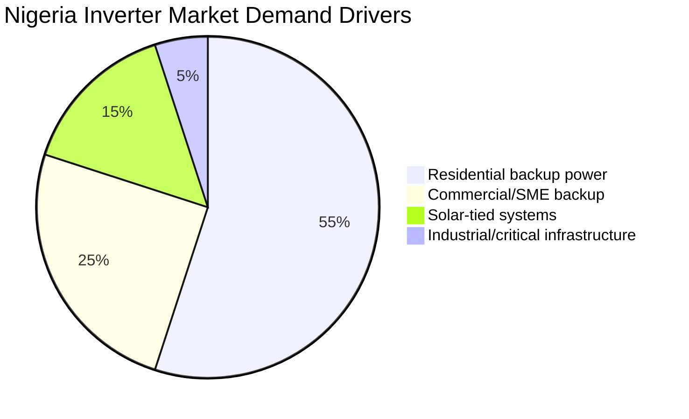

# Supply Chain Strategy

> **Factory:** Coo-Cah Garage & Power Electronics Factory — Sagamu, Ogun State  
> **Master Repo Ref:** [oumar-code/Coo-Kah-Doks](https://github.com/oumar-code/Coo-Kah-Doks) → `docs/standards/supply-chain-doctrine.md`

---

## 1. Semiconductor Supply Chain Strategy

### 1.1 The Critical Risk: Semiconductor Allocation

Power electronics manufacturing depends on power semiconductors (MOSFETs, IGBTs, gate driver ICs) that are:
- **Manufactured by a small number of global fabs** (Infineon in Germany, ON Semiconductor in US/Malaysia, TI in US/Philippines)
- **Subject to allocation** during demand spikes — automotive and industrial customers receive priority allocations; SMEs and new entrants are cut first
- **Long-lead-time items** — standard lead times 16–26 weeks; allocation periods have seen 52+ week lead times
- **Not replaceable** with generic alternatives without complete PCB redesign and requalification

For the Coo-Cah Electronics Power Factory, a semiconductor stockout means **production stops entirely**. This is the highest-risk single-point-of-failure in the supply chain.

### 1.2 Semiconductor Procurement Policy

| Element | Policy |
|---|---|
| **Safety stock — minimum** | 90 days production equivalent at planned Phase 1 run rate |
| **Safety stock — target** | 120 days (extended during global allocation events) |
| **Ordering frequency** | Monthly rolling forecast; purchase orders placed minimum 26 weeks forward |
| **Transport mode** | **AIR FREIGHT ONLY** — no sea freight on semiconductors; sea adds 4–6 weeks and increases allocation risk |
| **Sourcing** | **Dual-source mandatory** on every critical semiconductor — two qualified suppliers for each device |
| **Preferred distributors** | Arrow Electronics (Lagos office + global); Avnet (EMEA + Nigeria via freight); Mouser (US direct + DHL) |
| **Distributor authorisation** | Authorised distribution channels only — no grey market, no spot-buy from unauthorised sources |
| **Buffer trigger** | When stock drops below 60 days, emergency purchase order raised same day |

### 1.3 Why 90 Days? The Infineon/TI Allocation Case

During the 2020–2023 global semiconductor shortage:
- Infineon IPP60R080CFD7 (power MOSFET used in inverters) lead time extended from 16 weeks to 52+ weeks
- Customers without allocation agreements were completely cut off
- Factories holding <30 days stock were forced to halt production for months
- Spot-buy prices on grey market were 5–8× normal distributor price

**Coo-Cah's response:** 90-day minimum safety stock ensures the factory operates normally even if a complete 26-week global allocation event occurs. The 90-day buffer covers the period from "allocation event declared" to "new allocation agreement secured and air freight received."

### 1.4 Critical Semiconductor Register

| Component | Specification | Primary Source | Alternate Source | Safety Stock | Transport |
|---|---|---|---|---|---|
| Power MOSFET (inverter H-bridge) | Infineon IPP60R080CFD7 or equivalent (600V, 24A, TO-247) | Infineon via Arrow | ON Semiconductor NTHL160N65S3 via Avnet | 90 days | Air freight only |
| Power MOSFET (SCC high-side) | Infineon BSC093N15NS5 or equivalent (150V, 80A) | Infineon via Arrow | Vishay SiR622DP via Mouser | 90 days | Air freight only |
| IGBT module (3kVA+ inverters) | Infineon FS25R12W1T7 or equivalent (1200V, 25A) | Infineon via Avnet | Fuji Electric FGA25N120ANTDTU via Arrow | 90 days | Air freight only |
| Gate Driver IC | Texas Instruments TMS320F28035 DSP | TI via Arrow | TI alternative; no grey market | 90 days | Air freight only |
| Gate Driver IC (half-bridge) | Texas Instruments UCC27714 or IR2110 | TI via Mouser | Infineon IR2110 via Arrow | 90 days | Air freight only |
| PWM Controller IC | Microchip dsPIC33EP256MC206 | Microchip via Avnet | TI equivalent | 60 days | Air freight |
| Wi-Fi SoC (CCG-PS smart strip) | Espressif ESP32-WROOM-32E | Espressif via Arrow | Espressif direct | 60 days | Air freight |
| LDO / SMPS IC | Multiple (TI, Diodes Inc.) | Arrow / Mouser | Multiple alternates | 45 days | Air freight |

---

## 2. Transformer Core Import Strategy

### 2.1 Phase 1 — Import from China

| Parameter | Details |
|---|---|
| Primary supplier | Baoding Tianwei Group or Zhejiang Boway Alloy — silicon steel laminations (EI/ETD cores) |
| Toroidal cores | VACUUMSCHMELZE (Germany) for high-performance grades; Ningbo SUMWAY (China) for standard grades |
| Port of entry | Tin Can Island Port, Apapa, Lagos (sea freight) |
| Shipping mode | LCL or FCL sea freight; 22–28 days transit from Shanghai/Tianjin |
| Customs | Form M + SON CoC for silicon steel (classified as industrial input) |
| Safety stock | 60 days (sea freight lead time is the driver; 22-28 days + 7 days customs = ~35 days); 60 days provides 25-day buffer |
| Annual volume (Phase 1) | ~180 tonnes (EI laminations) + ~25 tonnes (toroidal cores) |

### 2.2 Phase 2 — Localisation Path

| Option | Feasibility | Timeline |
|---|---|---|
| Coo-Cah Metallurgical Factory — silicon steel rolling | HIGH feasibility if Coo-Cah Metallurgical achieves ISO grade silicon steel capability | 2027–2028 evaluation |
| Nigerian local steel laminators (e.g., Delta Steel) | LOW — current Nigerian steel production does not meet electrical-grade Si-steel specifications | Long-term (Phase 3+) |
| Partial localisation: import grain-oriented Si-steel strip; laminate in-house | MEDIUM — adds slitting and lamination stamping equipment (~$2M CapEx) | Phase 2 investigation |

**Decision gate:** Phase 2 localisation decision to be made in Q4 2026 based on Coo-Cah Metallurgical factory capability assessment.

---

## 3. Magnet Wire (Copper Winding Wire) Sourcing

Magnet wire is used in transformer and inductor winding. It is consumed in large quantities and is a commodity input.

| Supplier | Location | Grades | Delivery Mode | Safety Stock |
|---|---|---|---|---|
| Kabelmetal Nigeria Ltd | Lagos, Nigeria | AWG 20–40 (0.08mm–0.8mm); Class F insulation | Truck delivery from Lagos; 1–2 day lead time | 21 days (local supplier; reliable) |
| Nigerian Wire & Cable | Lagos, Nigeria | AWG 16–30 (0.25mm–1.6mm); Class H heavy-gauge | Truck delivery | 21 days |
| Apar Industries (India) | India (via sea import) | Specialist gauges — ultra-fine (AWG 38–42) and heavy (AWG 12–16) | Sea freight; 3–4 weeks | 45 days |
| Superior Essex (USA) | US (via air import for urgent needs) | High-temperature Class H specialist | Air freight emergency only | Hold 14 days of specialist grades |

**Strategy:** Local Nigerian suppliers cover ~70% of wire volume requirements. Import from India covers specialist gauges not available locally. The 21-day local safety stock is adequate given Lagos delivery reliability.

---

## 4. Electrolytic Capacitors

Electrolytic capacitors are critical components in inverter DC bus, filter stages, and UPS circuits. Quality capacitors (105°C, 3,000h+ rated) are mandatory for 2-year warranty reliability.

| Specification | Supplier | Transport | Safety Stock |
|---|---|---|---|
| High-ripple 105°C, 1,000V (inverter DC bus) | Nichicon HE/HXW series — Japan | Air freight | 45 days |
| Standard 105°C, 400V (general filter) | Rubycon YXJ series — Japan | Air/Sea mixed | 45 days |
| High-temp 125°C (near-transformer positions) | Cornell Dubilier (USA) or Kemet | Air freight | 45 days |
| Standard electrolytic (PCB general use) | Samxon or Lelon (Taiwan) | Sea freight LCL | 30 days |

**Quality note:** No-name, unbranded, or grey-market electrolytic capacitors are prohibited. Every capacitor lot receives incoming inspection: capacitance measurement, ESR test, and visual check on a sample basis.

---

## 5. PCB Bare Boards

| Phase | Strategy |
|---|---|
| Phase 1 | In-house SMT line produces all PCBs from imported bare boards. Raw boards imported from China/Taiwan via LCL sea freight (4–6 weeks). Board specifications: 2-layer standard through Phase 1; some 4-layer for main control board. |
| Phase 2 | Complex multi-layer boards (6-layer main inverter DSP board) consolidated to Coo-Cah Personal Electronics SMT line (if available and capacity allows). |

| Board Type | Source | Quantity/Year (Phase 1) | Lead Time | Safety Stock |
|---|---|---|---|---|
| 2-layer FR4 (SCC, power strip, small boards) | JLC PCB or Gold Circuit Electronics (China) via sea freight | ~200,000 panels | 4–6 weeks (sea) | 30 days |
| 4-layer FR4 (inverter control, UPS control) | WUS Printed Circuit (China) via sea freight | ~60,000 panels | 5–7 weeks | 35 days |
| 6-layer FR4 (main inverter DSP board — Phase 2) | Tripod Technology (Taiwan) or TTM Technologies | ~25,000 panels | 6–8 weeks | 40 days |

---

## 6. Plastic Enclosures — Strategic Intra-Group Supplier

> **The Coo-Cah Plastics & Polymers Factory (Agbara, Lagos) is the Tier A supplier for all plastic enclosures.** This is a strategic intra-group relationship — not a commercial procurement. It drives cost synergies, guarantees quality consistency, and eliminates import dependency on enclosures.

| Component | Specification | Annual Volume (Phase 1) | Lead Time | Safety Stock |
|---|---|---|---|---|
| Inverter housing (2kVA, 3kVA) | ABS+PC alloy; flame-rated UL94 V-0; IP21; colour: charcoal grey RAL 7016 | ~120,000 sets | 1–2 days (intra-group) | 7 days |
| Inverter housing (5kVA) | ABS+PC; IP21; larger chassis form; RAL 7016 | ~40,000 sets | 1–2 days | 7 days |
| SCC housing (MPPT/PWM all sizes) | ABS; IP32; deep-section PCB housing; black RAL 9005 | ~150,000 sets | 1–2 days | 7 days |
| Smart power strip body (4-way) | PC flame-retarded UL94 V-0; white RAL 9003 | ~200,000 units | 1–2 days | 7 days |
| Smart power strip body (6-way / 8-way) | PC UL94 V-0; white | ~300,000 units | 1–2 days | 7 days |
| UPS housing (600VA, 1kVA) | ABS+PC; cream RAL 9001; rack-mount option (1U steel overlay) | ~50,000 sets | 1–2 days | 7 days |
| Battery charger housing | ABS; IP22; black | ~80,000 sets | 1–2 days | 7 days |

**Enclosure specification process:** Coo-Cah Electronics Power Factory provides 3D CAD models (SolidWorks/STEP) to Coo-Cah Plastics. Tooling investment shared per group CapEx policy. First article inspection (FAI) required for each new mould. Colour and surface finish standard: matched to Coo-Cah group product design guideline (document in master repo).

**Interim supply (before Coo-Cah Plastics is operational):** Local Lagos injection moulders (e.g., Reckitt Plastics, Fine Brothers Engineering plastics division) supply interim. Lead time increases to 7–10 days; safety stock must be increased to 21 days during this period.

---

## 7. UPS Internal Batteries — Dangerous Goods (DG) Logistics

UPS units contain VRLA (Valve-Regulated Lead-Acid) sealed batteries which are classified as **Dangerous Goods — Class 8 (Corrosive) under IMDG regulations for sea freight.**

| Parameter | Requirement |
|---|---|
| Battery type | VRLA/SLA — sealed, non-spillable (meets IMDG Special Provision 238) |
| Primary supplier | CSB Battery Co. (Taiwan) — CSB GP series or HR series (high-rate UPS) |
| Alternate supplier | Vision Battery (Hong Kong) — CP series |
| **Shipping mode** | **SEA FREIGHT ONLY** (air freight of VRLA lead-acid batteries is prohibited under IATA DGR) |
| DG documentation | IMDG Dangerous Goods Declaration; UN2800 (non-spillable battery, electric storage); Packing Group III |
| Port | Tin Can Island Port; specialist DG freight forwarder required (certified IMDG handler) |
| Customs | Form M; NESREA import permit for lead-acid batteries |
| Safety stock | 45 days (sea freight lead time 28–35 days) |
| NESREA battery disposal | Licensed battery recycler required from Day 1 — see [docs/regulatory.md](./regulatory.md) |
| **Phase 2 evaluation** | Switch to LiFePO₄ packs from Coo-Cah BESS assembly line — eliminates DG classification; reduces weight 40%; 3× cycle life |

---

## 8. Safety Stock Policy Summary

| Component Category | Safety Stock | Reorder Point | Transport Mode |
|---|---|---|---|
| Power MOSFETs / IGBTs | 90 days | 60 days | Air freight mandatory |
| Gate Driver ICs / DSP | 90 days | 60 days | Air freight mandatory |
| Wi-Fi SoC (ESP32) | 60 days | 45 days | Air freight |
| Electrolytic Capacitors (critical grades) | 45 days | 35 days | Air / Sea mixed |
| UPS VRLA Batteries | 45 days | 35 days | Sea freight (DG) |
| PCB Bare Boards (4-layer+) | 35 days | 28 days | Sea freight LCL |
| Transformer Cores (EI laminations) | 60 days | 45 days | Sea freight |
| Magnet Wire (local supplier) | 21 days | 14 days | Road (local) |
| Plastic Enclosures (Coo-Cah Plastics) | 7 days | 5 days | Road (intra-group daily) |
| PCB Bare Boards (2-layer, standard) | 30 days | 22 days | Sea freight |
| Power Tool Motors | 45 days | 35 days | Sea freight |
| Solar Panels (SPK kits) | 30 days | 20 days | Sea freight |

---

## 9. Intra-Group Supply — What This Factory Delivers to Sister Factories

Once Phase 1 internal supply targets are met, all sister factory demands are fulfilled before external commercial sales commence.

| Product | Recipient | Quantity (Phase 1, Year 1) | Priority |
|---|---|---|---|
| CCG-INV-PSW 3kVA | All Coo-Cah factories (1–2 units per factory; ~15 factories) | ~30 units | CRITICAL — before external sale |
| CCG-INV-PSW 5kVA | Large Coo-Cah factories (chemical, metallurgical) | ~20 units | CRITICAL |
| CCG-UPS 1kVA (rack) | MES server rooms at every factory | ~15 units | CRITICAL |
| CCG-SCC-MPPT 40A | Coo-Cah energy/infrastructure team — all rooftop/ground solar | ~200 units | HIGH |
| CCG-SCC-MPPT 60A | Large solar installs (factories with 200kWp+ arrays) | ~50 units | HIGH |
| CCG-PS 6-way power strip | All Coo-Cah factories — workstations and IT equipment | ~500 units | HIGH |
| CCG-PT-DRILL (750W corded) | All factory maintenance workshops | ~45 units | MEDIUM |
| CCG-PT-AG (125mm / 1000W) | All factory maintenance workshops | ~45 units | MEDIUM |

**Logistics:** Internal supply via Coo-Cah owned logistics fleet. No commercial pricing for internal transfers — inter-company transfer price per group accounting policy. Delivery coordinated by Coo-Cah Operations central team.

---

## 10. Nigerian & West African Market Opportunity

### 10.1 Nigeria Inverter + Solar Market Sizing

| Market Metric | Value | Source |
|---|---|---|
| Nigeria inverter market size | >2 million units/year | Industry estimates (2024) |
| Market growth rate | 15–20%/year | Driven by grid deterioration |
| Estimated market value (at ₦150k average unit price) | ~₦300 billion/year (~$188M/year) | Calculated |
| Coo-Cah Phase 1 production (inverters) | 200,000 units/year | Internal target |
| Coo-Cah Phase 1 market share target | ~10% | Achievable for a new entrant with local warranty |

### 10.2 Competitive Positioning

| Factor | Imported (Chinese OEM) | Coo-Cah (Local) |
|---|---|---|
| Price | Low–Medium | Medium (5–15% premium) |
| Warranty | 12 months; return-to-importer (Lagos distributor) | **24 months; factory-direct aftersales (Sagamu)** |
| Availability of spares | Slow; import-dependent | **Fast; on-site spare parts; 48h repair SLA** |
| Customisation | None | **Custom firmware; custom voltage settings; OEM branding** |
| "Made in Nigeria" brand | None | **SON C-Mark; Nigerian-made premium** |
| Local support | Distributor-dependent | **Direct Coo-Cah aftersales centre in Sagamu** |

### 10.3 Distribution Strategy

| Channel | Phase 1 Focus | Phase 2 Expansion |
|---|---|---|
| Direct B2B (large corporates, hotels, hospitals) | YES — high-value units (3kVA, 5kVA, UPS) | Expand to state governments, military |
| Solar installers / EPC contractors | YES — SCC, solar kits | Certified Coo-Cah Installer programme |
| Electrical wholesale distributors | YES — Lagos, Abuja, PH, Kano | Expand to Enugu, Kaduna, Ibadan |
| Online (Jumia, Konga, direct e-commerce) | YES — power strips, small inverters | Own website with warranty registration |
| Export — West Africa (Ghana, Côte d'Ivoire) | Phase 2 | ECOWAS TEC certification required |

